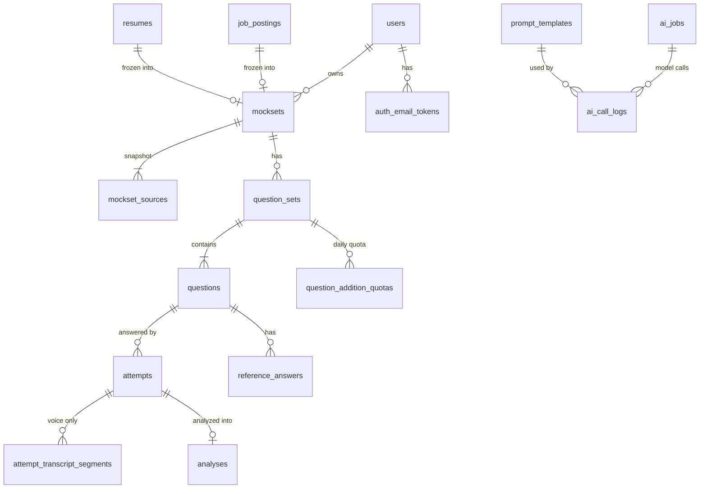

# reMockable Backend — Table Schema（與 Tech Lead 討論用）

| 項目 | 值 |
|---|---|
| 文件版本 | v0.1.0 |
| 對應 Spec | reMockable MVP SPEC v0.8.0 |
| 資料庫 | AWS RDS（**引擎未定**，本文件使用引擎中立 DDL） |
| ORM | Spring Data JPA / Hibernate 6 |
| Migration | Flyway |

> **本文件的目的**：跟 Tech Lead 確認資料模型後才開始寫 Entity。
> 引擎選定後（PostgreSQL 或 MySQL 8），依 [§7 引擎差異對照](#7-引擎差異對照) 調整型別即可，表結構不變。

---

## 1. 設計原則

| 原則 | 說明 |
|---|---|
| **凍結快照** | Mock Set 建立後，JD 與履歷的解析結果複製一份到 `mockset_sources`。後續生題、參考答案、分析**只讀這份快照**，不回頭讀原始上傳資料（Spec §4.7.3 CCP「凍結」與「重用」）|
| **不可變回答** | `attempts` 建立後 `content` 不可更新。重錄以新增 row + 舊 row 標記 `SUPERSEDED` 實作，不做 UPDATE |
| **AI 產出可追溯** | 每筆 AI 產出都記錄 `prompt_id` / `prompt_version` / `model` / `source_content_hash`（Spec §13.2）|
| **分數存但不外流** | 三個 Fit 的 0–100 分存成實體欄位供評估查詢，**API 不回傳**（Spec D-025）|
| **P1 無帳號** | 所有 `user_id` 為 nullable。P2C 登入上線後開始寫入，不需要改表結構 |
| **不記錄敏感內容** | `product_events.metadata` 與應用 log 絕不寫入履歷全文、回答全文或逐字稿（Spec §13.1）|

### 命名慣例

- 表名：**複數、snake_case**（`mocksets`、`question_sets`）
- 主鍵：`id`，型別 `VARCHAR(40)`，格式 `<prefix>_<ULID>`（例：`ms_01J8X2K4M7QRSTVWXYZ0123`）
  - **為什麼不用自增整數**：ID 會出現在 URL 與前端 localStorage，自增整數可被列舉；ULID 同時保有時間排序性，方便除錯與分頁
- 時間：一律 `TIMESTAMP`，**UTC 儲存**，欄位名 `*_at`
- 布林：`BOOLEAN`（MySQL 為 `TINYINT(1)`）
- JSON：`TEXT`（Postgres 改 `JSONB`、MySQL 改 `JSON`，見 §7）
- Enum：`VARCHAR(n)` + `CHECK` 約束，**不使用資料庫原生 ENUM**（改值要 DDL，太痛）

---

## 2. ERD



---

## 3. 資料表定義

### 3.1 `users` — 使用者（P2C 起寫入）

```sql
CREATE TABLE users (
  id              VARCHAR(40)  NOT NULL,
  email           VARCHAR(320) NOT NULL,
  display_name    VARCHAR(100)     NULL,
  auth_provider   VARCHAR(20)  NOT NULL,   -- EMAIL | GOOGLE
  google_sub      VARCHAR(255)     NULL,   -- Google OAuth subject（P3）
  status          VARCHAR(20)  NOT NULL DEFAULT 'ACTIVE',  -- ACTIVE | DISABLED
  last_login_at   TIMESTAMP        NULL,
  created_at      TIMESTAMP    NOT NULL,
  updated_at      TIMESTAMP    NOT NULL,
  CONSTRAINT pk_users PRIMARY KEY (id),
  CONSTRAINT uq_users_email UNIQUE (email),
  CONSTRAINT uq_users_google_sub UNIQUE (google_sub),
  CONSTRAINT ck_users_provider CHECK (auth_provider IN ('EMAIL','GOOGLE')),
  CONSTRAINT ck_users_status   CHECK (status IN ('ACTIVE','DISABLED'))
);
```

> **P1A/P1B 這張表是空的。** 以無帳號流程驗證，所有 `user_id` 為 `NULL`。
> P2C 上線後開始寫入 —— 屆時不需要改任何其他表的結構。

---

### 3.2 `auth_email_tokens` — Email 驗證信 token（P2C）

```sql
CREATE TABLE auth_email_tokens (
  id           VARCHAR(40)  NOT NULL,
  email        VARCHAR(320) NOT NULL,
  token_hash   VARCHAR(64)  NOT NULL,   -- SHA-256(token)，明文只出現在信件裡
  expires_at   TIMESTAMP    NOT NULL,   -- 建立後 15 分鐘
  consumed_at  TIMESTAMP        NULL,   -- 用過即失效，不可重複使用
  created_ip   VARCHAR(45)      NULL,
  created_at   TIMESTAMP    NOT NULL,
  CONSTRAINT pk_auth_email_tokens PRIMARY KEY (id),
  CONSTRAINT uq_auth_email_tokens_hash UNIQUE (token_hash)
);
CREATE INDEX idx_auth_email_tokens_email ON auth_email_tokens (email, created_at);
```

> **只存 hash，不存明文 token。** 資料庫外洩時攻擊者無法直接用它登入。

---

### 3.3 `job_postings` — 職缺資訊解析結果（Spec 4.1）

```sql
CREATE TABLE job_postings (
  id                     VARCHAR(40)  NOT NULL,
  user_id                VARCHAR(40)      NULL,   -- P1 為 NULL
  input_type             VARCHAR(10)  NOT NULL,   -- TEXT | URL
  source_url             VARCHAR(2048)    NULL,   -- 僅 CakeResume（本輪 104/LinkedIn 不做）
  source_text            TEXT         NOT NULL,   -- 貼上的文字，或爬回來的頁面純文字
  source_content_hash    VARCHAR(71)  NOT NULL,   -- 'sha256:' + 64 hex

  -- 解析出的六個欄位。無法擷取者為 NULL，前端顯示 '--'（Spec D-021、AC-02）
  job_title              VARCHAR(255)     NULL,
  company_name           VARCHAR(255)     NULL,
  industry               VARCHAR(255)     NULL,
  experience             VARCHAR(500)     NULL,
  job_description        TEXT             NULL,
  requirements           TEXT             NULL,

  extracted_field_count  SMALLINT     NOT NULL DEFAULT 0,  -- 「已讀取 x 個欄位」
  missing_fields         TEXT         NOT NULL DEFAULT '[]',
  parse_status           VARCHAR(20)  NOT NULL,   -- READY | FAILED
  prompt_id              VARCHAR(20)      NULL,   -- P00
  prompt_version         VARCHAR(20)      NULL,
  model                  VARCHAR(100)     NULL,
  created_at             TIMESTAMP    NOT NULL,
  CONSTRAINT pk_job_postings PRIMARY KEY (id),
  CONSTRAINT ck_job_postings_input CHECK (input_type IN ('TEXT','URL')),
  CONSTRAINT ck_job_postings_status CHECK (parse_status IN ('READY','FAILED'))
);
CREATE INDEX idx_job_postings_user ON job_postings (user_id, created_at);
CREATE INDEX idx_job_postings_hash ON job_postings (source_content_hash);
```

**設計理由**
- **六個欄位拆成實體欄位而非塞 JSON**：它們是固定的產品欄位（Spec 4.1.4.4 明列），前端逐欄顯示，未來也可能要做「同公司職缺」之類的查詢。塞 JSON 只會讓每次讀取都要反序列化。
- **`source_content_hash` 的用途**：同一份 JD 重複貼上時可以命中既有解析結果，省一次模型呼叫。也是 Spec §13.2 要求的 `source content hashes`。

---

### 3.4 `resumes` — 履歷（Spec 4.1）

```sql
CREATE TABLE resumes (
  id                   VARCHAR(40)  NOT NULL,
  user_id              VARCHAR(40)      NULL,
  original_filename    VARCHAR(255) NOT NULL,
  mime_type            VARCHAR(100) NOT NULL,   -- 本輪僅 application/pdf
  byte_size            BIGINT       NOT NULL,   -- ≤ 10,000,000
  storage_key          VARCHAR(512) NOT NULL,   -- S3 object key，非 URL
  extracted_text       TEXT         NOT NULL,
  page_count           SMALLINT         NULL,
  content_hash         VARCHAR(71)  NOT NULL,
  extract_status       VARCHAR(20)  NOT NULL,   -- READY | FAILED
  created_at           TIMESTAMP    NOT NULL,
  purge_after          TIMESTAMP        NULL,   -- 資料保留策略，待 PM 給政策
  CONSTRAINT pk_resumes PRIMARY KEY (id),
  CONSTRAINT ck_resumes_status CHECK (extract_status IN ('READY','FAILED'))
);
CREATE INDEX idx_resumes_user ON resumes (user_id, created_at);
CREATE INDEX idx_resumes_purge ON resumes (purge_after);
```

**設計理由**
- **`storage_key` 存 key 不存 URL**：S3 URL 會因為 bucket 搬遷、CDN 換域名而失效；存 key 才能在任何時候重新產生簽名 URL。
- **`purge_after` 現在就建欄位**：Spec §17.5 把「Resume、JD、音檔、transcript 的保存時間」列為 Open。政策還沒定，但欄位先留，PM 一給政策就能跑 retention job，不用改表。

---

### 3.5 `mocksets` — Mock Set（Spec 4.1）

```sql
CREATE TABLE mocksets (
  id               VARCHAR(40)  NOT NULL,
  user_id          VARCHAR(40)      NULL,
  name             VARCHAR(100) NOT NULL,   -- 使用者輸入的練習名稱，≥ 2 字元，建立後不可改
  job_posting_id   VARCHAR(40)  NOT NULL,
  resume_id        VARCHAR(40)  NOT NULL,
  status           VARCHAR(20)  NOT NULL DEFAULT 'READY',
  frozen_at        TIMESTAMP    NOT NULL,   -- 來源資料凍結時間（Spec M-04）
  created_at       TIMESTAMP    NOT NULL,
  CONSTRAINT pk_mocksets PRIMARY KEY (id),
  CONSTRAINT fk_mocksets_job_posting FOREIGN KEY (job_posting_id) REFERENCES job_postings (id),
  CONSTRAINT fk_mocksets_resume      FOREIGN KEY (resume_id)      REFERENCES resumes (id),
  CONSTRAINT ck_mocksets_status CHECK (status IN ('READY','ARCHIVED'))
);
CREATE INDEX idx_mocksets_user ON mocksets (user_id, created_at);
```

> **沒有 `UPDATE` 路徑。** Spec M-04／D-003：建立後 JD 與履歷不可修改，要換資料只能建新的 Mock Set。
> 因此也沒有 `updated_at` 欄位 —— 這是刻意的，不是遺漏。

> ⚠️ **`name` 是使用者輸入的練習名稱，不是 JD 解析出的職稱。**
> 職稱在 `job_postings.job_title`。Spec §4.7.2 特別區分過這兩者，實作時很容易搞混。

---

### 3.6 `mockset_sources` — 凍結快照（Spec §4.7.3 CCP）

```sql
CREATE TABLE mockset_sources (
  id              VARCHAR(40) NOT NULL,
  mockset_id      VARCHAR(40) NOT NULL,
  type            VARCHAR(20) NOT NULL,   -- JD | RESUME
  extracted_text  TEXT        NOT NULL,
  sections        TEXT        NOT NULL DEFAULT '[]',
  content_hash    VARCHAR(71) NOT NULL,
  created_at      TIMESTAMP   NOT NULL,
  CONSTRAINT pk_mockset_sources PRIMARY KEY (id),
  CONSTRAINT fk_mockset_sources_mockset FOREIGN KEY (mockset_id) REFERENCES mocksets (id) ON DELETE CASCADE,
  CONSTRAINT uq_mockset_sources UNIQUE (mockset_id, type),
  CONSTRAINT ck_mockset_sources_type CHECK (type IN ('JD','RESUME'))
);
```

`sections` 的形狀：

```json
[
  { "section_id": "jd_requirements", "heading": "Requirements", "content": "..." }
]
```

**為什麼要這張表（這是最容易被質疑的設計，先講清楚）**

乍看之下這是 `job_postings` + `resumes` 的重複資料。但 Spec §4.7.3 的 CCP 管線明確要求「凍結」：

> 4. **凍結**：Mock Set 建立後，固定該 Mock Set 對應的 job_profile、candidate_profile 與版本資訊。
> 5. **重用**：4.2–4.5 的題目生成、參考答案與回答分析均使用已驗證的標準資料。

沒有這張表的話，如果之後加了「重新解析 JD」或修正解析邏輯，**既有 Mock Set 的題目與分析會突然對不上它們當初依據的資料**，AI 產出的可追溯性（Spec §13.2）就斷了。

另外 `sections` 讓 prompt 可以引用具體段落（`jd_requirements`）而不是整包文字丟進去，這是 grounding 檢查能運作的前提。

---

### 3.7 `question_sets` — 題目集（Spec 4.2）

```sql
CREATE TABLE question_sets (
  id                 VARCHAR(40) NOT NULL,
  mockset_id         VARCHAR(40) NOT NULL,
  category           VARCHAR(20) NOT NULL,   -- INTRODUCTION | BEHAVIORAL | TECHNICAL | CULTURAL_FIT
  language           VARCHAR(10) NOT NULL DEFAULT 'en',
  status             VARCHAR(20) NOT NULL,   -- READY | FAILED
  prompt_id          VARCHAR(20)     NULL,   -- P01
  prompt_version     VARCHAR(20)     NULL,
  model              VARCHAR(100)    NULL,
  created_at         TIMESTAMP   NOT NULL,
  CONSTRAINT pk_question_sets PRIMARY KEY (id),
  CONSTRAINT fk_question_sets_mockset FOREIGN KEY (mockset_id) REFERENCES mocksets (id) ON DELETE CASCADE,
  CONSTRAINT uq_question_sets UNIQUE (mockset_id, category),
  CONSTRAINT ck_question_sets_category CHECK (category IN ('INTRODUCTION','BEHAVIORAL','TECHNICAL','CULTURAL_FIT')),
  CONSTRAINT ck_question_sets_status CHECK (status IN ('READY','FAILED'))
);
```

> **`UNIQUE (mockset_id, category)` 是 M-07「沿用題目」的實作核心。**
> 有這個唯一約束，「同一 Mock Set + 同一題型只會有一組題目」就由資料庫保證，
> 而不是靠應用層記得先查一次。使用者連點兩下「下一步」時，第二次會撞唯一鍵而不是生出第二組題目。

---

### 3.8 `questions` — 題目（Spec 4.3）

```sql
CREATE TABLE questions (
  id                     VARCHAR(40)  NOT NULL,
  question_set_id        VARCHAR(40)  NOT NULL,
  mockset_id             VARCHAR(40)  NOT NULL,   -- 反正規化：跨題型查詢與去重時避免 join
  category               VARCHAR(20)  NOT NULL,
  position               SMALLINT     NOT NULL,   -- 1 起算，前端顯示為 01、02……
  question_text          TEXT         NOT NULL,   -- 英文題目
  question_translation   TEXT         NOT NULL DEFAULT '',  -- 繁中翻譯（Spec D-031、AC-11）
  difficulty             VARCHAR(10)  NOT NULL DEFAULT 'MEDIUM',  -- EASY | MEDIUM | HARD
  intent                 TEXT         NOT NULL DEFAULT '',
  expected_evidence      TEXT         NOT NULL DEFAULT '[]',
  personalization_level  VARCHAR(20)  NOT NULL DEFAULT 'GENERAL', -- PERSONALIZED | GENERAL
  source_references      TEXT         NOT NULL DEFAULT '[]',      -- 引用了哪些 mockset_sources 段落
  origin                 VARCHAR(10)  NOT NULL DEFAULT 'INITIAL', -- INITIAL | ADDED
  embedding              TEXT             NULL,  -- 語意去重用；失敗時降級為完全比對
  created_at             TIMESTAMP    NOT NULL,
  CONSTRAINT pk_questions PRIMARY KEY (id),
  CONSTRAINT fk_questions_set FOREIGN KEY (question_set_id) REFERENCES question_sets (id) ON DELETE CASCADE,
  CONSTRAINT uq_questions_position UNIQUE (question_set_id, position),
  CONSTRAINT ck_questions_difficulty CHECK (difficulty IN ('EASY','MEDIUM','HARD')),
  CONSTRAINT ck_questions_origin CHECK (origin IN ('INITIAL','ADDED')),
  CONSTRAINT ck_questions_personalization CHECK (personalization_level IN ('PERSONALIZED','GENERAL'))
);
CREATE INDEX idx_questions_set ON questions (question_set_id, position);
CREATE INDEX idx_questions_mockset ON questions (mockset_id);
```

**設計理由**
- **`embedding` 存 TEXT（JSON 陣列）而非向量型別**：本輪只用來做「新增題目時跟既有題目太像就重生」的去重，不做向量檢索。上 pgvector 是為了還不存在的需求付維運成本。**這點想聽 Tech Lead 意見**。
- **`personalization_level` / `source_references`**：Spec D-022 要求「題目生成前判斷 JD 與 Resume 是否足以產生個人化題目」，§15.3 的模型品質評估要檢查「個人化內容是否有 source reference」。沒有這兩欄就無法做評估。

---

### 3.9 `question_addition_quotas` — 每日新增題目額度（Spec M-18、D-010）

```sql
CREATE TABLE question_addition_quotas (
  id                VARCHAR(40) NOT NULL,
  question_set_id   VARCHAR(40) NOT NULL,
  quota_date        DATE        NOT NULL,   -- Asia/Taipei 當地日期
  used_count        SMALLINT    NOT NULL DEFAULT 0,
  updated_at        TIMESTAMP   NOT NULL,
  CONSTRAINT pk_question_addition_quotas PRIMARY KEY (id),
  CONSTRAINT fk_quotas_set FOREIGN KEY (question_set_id) REFERENCES question_sets (id) ON DELETE CASCADE,
  CONSTRAINT uq_quotas UNIQUE (question_set_id, quota_date),
  CONSTRAINT ck_quotas_used CHECK (used_count >= 0 AND used_count <= 3)
);
```

**設計理由（這張表值得特別說明）**

Prototype 的 Node scaffold 是用「當日 event 計數」推算已用額度。**這個做法有兩個問題**：

1. Spec 4.3.4.5 明確要求「**生成失敗不消耗當日新增次數**」。用 event 推算就必須小心過濾失敗事件，容易算錯。
2. event 表是可清理的觀測資料，拿它當業務規則的真相來源，之後做 log rotation 會意外把額度重置。

用獨立表 + `UNIQUE (question_set_id, quota_date)`，配合 `INSERT ... ON CONFLICT DO UPDATE SET used_count = used_count + 1`（Postgres）或 `INSERT ... ON DUPLICATE KEY UPDATE`（MySQL），**額度遞增是原子的**，使用者連點也不會超額。

> **`quota_date` 用 Asia/Taipei 當地日期。** 使用者認知的「今天」是台北時間的今天。
> 用 UTC 日期會讓台灣時間早上 8 點前重置，體感很怪。

---

### 3.10 `attempts` — 回答（Spec 4.4）

```sql
CREATE TABLE attempts (
  id                  VARCHAR(40)  NOT NULL,
  question_id         VARCHAR(40)  NOT NULL,
  mockset_id          VARCHAR(40)  NOT NULL,
  user_id             VARCHAR(40)      NULL,
  attempt_number      SMALLINT     NOT NULL,   -- 1 起算，只計算已完成分析的次數
  input_mode          VARCHAR(10)  NOT NULL,   -- TEXT | VOICE
  content             TEXT         NOT NULL,   -- 實際送分析的內容，建立後不可修改

  -- 語音專用。文字模式全部為 NULL / 預設值
  audio_storage_key   VARCHAR(512)     NULL,
  audio_mime_type     VARCHAR(100)     NULL,
  audio_byte_size     BIGINT           NULL,
  transcript_status   VARCHAR(20)  NOT NULL DEFAULT 'NOT_APPLICABLE',

  duration_seconds    SMALLINT     NOT NULL DEFAULT 0,  -- 瀏覽器計時，僅供參考
  state               VARCHAR(20)  NOT NULL DEFAULT 'ACTIVE',   -- ACTIVE | SUPERSEDED
  analysis_status     VARCHAR(20)  NOT NULL DEFAULT 'PENDING',  -- PENDING | READY | FAILED
  created_at          TIMESTAMP    NOT NULL,
  purge_after         TIMESTAMP        NULL,
  CONSTRAINT pk_attempts PRIMARY KEY (id),
  CONSTRAINT fk_attempts_question FOREIGN KEY (question_id) REFERENCES questions (id) ON DELETE CASCADE,
  CONSTRAINT ck_attempts_mode   CHECK (input_mode IN ('TEXT','VOICE')),
  CONSTRAINT ck_attempts_state  CHECK (state IN ('ACTIVE','SUPERSEDED')),
  CONSTRAINT ck_attempts_status CHECK (analysis_status IN ('PENDING','READY','FAILED')),
  CONSTRAINT ck_attempts_transcript CHECK (transcript_status IN ('NOT_APPLICABLE','PENDING','CONFIRMED','FAILED'))
);
CREATE INDEX idx_attempts_question ON attempts (question_id, state, attempt_number);
CREATE INDEX idx_attempts_user ON attempts (user_id, created_at);
CREATE INDEX idx_attempts_purge ON attempts (purge_after);
```

**設計理由**
- **`content` 單一欄位，不分 `answer_text` / `transcript`**：兩種模式的內容互斥，且下游（分析）只關心「送進來的是什麼文字」。分成兩欄會讓每個讀取點都要寫 `if (mode == VOICE) ... else ...`。模式資訊在 `input_mode`，需要區分時查那一欄。
- **`state = SUPERSEDED` 而非刪除**：Spec §17.2「重新錄音只清除目前回答，不新增 Attempt；成功送出分析時才保存 Attempt」。實作上保留 row 但標記取代，這樣 `attempt_number` 不會跳號，也保留了使用者實際重試幾次的觀測資料。
- **`duration_seconds` 只存不驗（文字模式）**：瀏覽器計時器無法可信驗證。90 秒是前端 enforcement（Spec AC-05）。語音模式則用 ffprobe 驗證音檔真實長度後才寫入。**這點要跟 PM 講清楚**。

---

### 3.11 `attempt_transcript_segments` — 逐字稿時間序（P2B）

```sql
CREATE TABLE attempt_transcript_segments (
  id           VARCHAR(40) NOT NULL,
  attempt_id   VARCHAR(40) NOT NULL,
  seq          SMALLINT    NOT NULL,   -- 1 起算
  start_ms     INTEGER     NOT NULL,
  end_ms       INTEGER     NOT NULL,
  text         TEXT        NOT NULL,
  CONSTRAINT pk_attempt_transcript_segments PRIMARY KEY (id),
  CONSTRAINT fk_segments_attempt FOREIGN KEY (attempt_id) REFERENCES attempts (id) ON DELETE CASCADE,
  CONSTRAINT uq_segments UNIQUE (attempt_id, seq),
  CONSTRAINT ck_segments_range CHECK (end_ms >= start_ms)
);
```

> **P1A/P1B 這張表是空的**，但現在就建。
> Spec 4.5.4.5「語音回答的對應時間區間於『你的回答』中呈現」與你提到的「逐字稿需要有時間序」都靠它。
> 2B 上線時只要開始寫入，**不需要 migration**。

---

### 3.12 `analyses` — 分析結果（Spec 4.5）

```sql
CREATE TABLE analyses (
  id                          VARCHAR(40)  NOT NULL,
  attempt_id                  VARCHAR(40)  NOT NULL,
  previous_attempt_id         VARCHAR(40)      NULL,  -- COMPARISON 時指向前一次
  analysis_type               VARCHAR(20)  NOT NULL,  -- FIRST | COMPARISON
  overall_state               VARCHAR(30)  NOT NULL,  -- STRONG | ACCEPTABLE | NEEDS_IMPROVEMENT

  -- 三個 Fit：分數與燈號都存成實體欄位
  jd_fit_score                SMALLINT     NOT NULL,
  jd_fit_state                VARCHAR(10)  NOT NULL,
  answer_fit_score            SMALLINT     NOT NULL,
  answer_fit_state            VARCHAR(10)  NOT NULL,
  delivery_fit_score          SMALLINT     NOT NULL,
  delivery_fit_state          VARCHAR(10)  NOT NULL,

  result                      TEXT         NOT NULL,  -- 完整 AI 輸出（fits 說明、priority_improvement、comparison）
  unsupported_claims_detected BOOLEAN      NOT NULL DEFAULT FALSE,
  prompt_id                   VARCHAR(20)  NOT NULL,  -- P05/P06/P07（A01 / A02）
  prompt_version              VARCHAR(20)  NOT NULL,
  model                       VARCHAR(100) NOT NULL,
  created_at                  TIMESTAMP    NOT NULL,
  CONSTRAINT pk_analyses PRIMARY KEY (id),
  CONSTRAINT fk_analyses_attempt FOREIGN KEY (attempt_id) REFERENCES attempts (id) ON DELETE CASCADE,
  CONSTRAINT uq_analyses_attempt UNIQUE (attempt_id),
  CONSTRAINT ck_analyses_type  CHECK (analysis_type IN ('FIRST','COMPARISON')),
  CONSTRAINT ck_analyses_jd    CHECK (jd_fit_score BETWEEN 0 AND 100 AND jd_fit_state IN ('RED','YELLOW','GREEN')),
  CONSTRAINT ck_analyses_ans   CHECK (answer_fit_score BETWEEN 0 AND 100 AND answer_fit_state IN ('RED','YELLOW','GREEN')),
  CONSTRAINT ck_analyses_del   CHECK (delivery_fit_score BETWEEN 0 AND 100 AND delivery_fit_state IN ('RED','YELLOW','GREEN'))
);
```

**設計理由**

- **`UNIQUE (attempt_id)` 讓分析天然冪等。** 同一個 attempt 只會有一筆分析，重複點「開始分析」不會產生第二次模型呼叫（Spec §13.3）。
- **六個 Fit 欄位拉出來，不留在 `result` JSON 裡。** 理由有三個：
  1. Spec D-025 要求「Server 保存 numeric score」，而 §15.3 的模型品質評估需要跨筆查詢分數分布
  2. 燈號門檻（90 / 60）之後若調整，可以用 SQL 重算並驗證影響範圍
  3. `CHECK` 約束能在資料庫層擋住「score 92 但 state 是 YELLOW」這種模型輸出不一致
- **`result` 保留完整 AI 輸出**：`fits.*.reason` / `signal` / `evidence`、`priority_improvement`、`comparison` 都是巢狀且會隨 prompt 版本演化的自由文字，拆表沒有查詢價值。

> ⚠️ **`*_score` 絕不出現在任何 API response。** Spec D-025：「UI 不顯示數字」。
> DTO 層只映射 `*_state`。建議在 code review checklist 加一條檢查。

---

### 3.13 `reference_answers` — 參考答案（Spec 4.4）

```sql
CREATE TABLE reference_answers (
  id                  VARCHAR(40)  NOT NULL,
  question_id         VARCHAR(40)  NOT NULL,
  user_id             VARCHAR(40)      NULL,
  source              VARCHAR(20)  NOT NULL,  -- USER_REQUESTED | FROM_ANALYSIS
  answer_text         TEXT         NOT NULL,  -- ≤ 2000 字元
  outline             TEXT         NOT NULL DEFAULT '[]',
  practice_tip        TEXT         NOT NULL DEFAULT '',
  requires_user_fill  BOOLEAN      NOT NULL DEFAULT FALSE,
  placeholders        TEXT         NOT NULL DEFAULT '[]',
  source_references   TEXT         NOT NULL DEFAULT '[]',
  prompt_id           VARCHAR(20)  NOT NULL,  -- P03
  prompt_version      VARCHAR(20)  NOT NULL,
  model               VARCHAR(100) NOT NULL,
  created_at          TIMESTAMP    NOT NULL,
  CONSTRAINT pk_reference_answers PRIMARY KEY (id),
  CONSTRAINT fk_reference_answers_question FOREIGN KEY (question_id) REFERENCES questions (id) ON DELETE CASCADE,
  CONSTRAINT uq_reference_answers UNIQUE (question_id, source),
  CONSTRAINT ck_reference_answers_source CHECK (source IN ('USER_REQUESTED','FROM_ANALYSIS'))
);
```

**設計理由**

`UNIQUE (question_id, source)` 而不是 `UNIQUE (question_id)` —— 這是刻意為了**吸收一個尚未拍板的 Spec 歧義**：

- AC-06 說「若使用者沒有點擊『生成參考答案』，不顯示 reference answer」→ 暗示參考答案是使用者主動觸發的
- 但 A01 分析輸出的 `priority_improvement` 本身就含一個 `reference_answer` 欄位（Spec 4.5.4.8）
- 而 4.4「參考前次答案」又說內容來源是「4.5.4.8 最優先改善欄位 - 參考答案」

**這兩個到底是同一份還是兩份，Spec 沒有講清楚。**（已列入 PM 待確認清單第 1 項）

用 `source` 欄位的話：**PM 無論怎麼決定都不需要改表。** 判定是同一份 → 只用一個 source 值；
判定是兩份 → 兩筆並存，`GET /questions/{id}/reference-answer` 依規則挑一筆回。

---

### 3.14 `ai_jobs` — 非同步工作（本輪架構核心）

```sql
CREATE TABLE ai_jobs (
  id                VARCHAR(40)  NOT NULL,
  user_id           VARCHAR(40)      NULL,
  job_type          VARCHAR(40)  NOT NULL,
  target_type       VARCHAR(40)      NULL,   -- MOCKSET | QUESTION_SET | QUESTION | ATTEMPT
  target_id         VARCHAR(40)      NULL,
  status            VARCHAR(20)  NOT NULL DEFAULT 'QUEUED',
  progress          SMALLINT     NOT NULL DEFAULT 0,   -- 0-100，對外除以 100
  request_payload   TEXT         NOT NULL DEFAULT '{}',
  result            TEXT             NULL,
  error_code        VARCHAR(50)      NULL,
  error_message_key VARCHAR(80)      NULL,
  retry_count       SMALLINT     NOT NULL DEFAULT 0,
  started_at        TIMESTAMP        NULL,
  finished_at       TIMESTAMP        NULL,
  expires_at        TIMESTAMP    NOT NULL,   -- created_at + 24h
  created_at        TIMESTAMP    NOT NULL,
  CONSTRAINT pk_ai_jobs PRIMARY KEY (id),
  CONSTRAINT ck_ai_jobs_status CHECK (status IN ('QUEUED','RUNNING','READY','FAILED')),
  CONSTRAINT ck_ai_jobs_type CHECK (job_type IN (
    'JOB_POSTING_PARSE','QUESTION_SET_GENERATION','QUESTION_ADDITION',
    'ATTEMPT_TRANSCRIPTION','REFERENCE_ANSWER_GENERATION','ANSWER_ANALYSIS'))
);
CREATE INDEX idx_ai_jobs_status ON ai_jobs (status, created_at);
CREATE INDEX idx_ai_jobs_target ON ai_jobs (target_type, target_id);
CREATE INDEX idx_ai_jobs_expires ON ai_jobs (expires_at);
```

> **`request_payload` 存的是參數（category、mockset_id），不是使用者原始內容。**
> 履歷與回答全文留在各自的表，job 只帶引用，避免敏感資料被複製到多處。

---

### 3.15 `idempotency_keys` — 冪等（Spec §13.3）

```sql
CREATE TABLE idempotency_keys (
  id               VARCHAR(40)  NOT NULL,
  idempotency_key  VARCHAR(64)  NOT NULL,
  user_id          VARCHAR(40)      NULL,
  endpoint         VARCHAR(200) NOT NULL,   -- METHOD + path pattern
  request_hash     VARCHAR(71)  NOT NULL,   -- 同 key 不同 body 要視為衝突
  response_status  SMALLINT         NULL,
  response_body    TEXT             NULL,
  state            VARCHAR(20)  NOT NULL DEFAULT 'IN_PROGRESS',  -- IN_PROGRESS | COMPLETED
  expires_at       TIMESTAMP    NOT NULL,   -- created_at + 24h
  created_at       TIMESTAMP    NOT NULL,
  CONSTRAINT pk_idempotency_keys PRIMARY KEY (id),
  CONSTRAINT uq_idempotency_keys UNIQUE (idempotency_key, endpoint),
  CONSTRAINT ck_idempotency_state CHECK (state IN ('IN_PROGRESS','COMPLETED'))
);
CREATE INDEX idx_idempotency_expires ON idempotency_keys (expires_at);
```

**設計理由**

Spec §13.3 有三條硬性要求，這張表一次解決：

> - 具 idempotency key 的請求不可重複建立同一個 Attempt
> - 使用者重新整理頁面不應重複生成題目或重複扣模型成本
> - 失敗狀態可重新嘗試，但不覆蓋已成功的結果

`state = IN_PROGRESS` 的存在很重要：使用者連點兩下時，第二個請求會看到 `IN_PROGRESS`
而回 `409` 或直接回同一個 `job_id`，而不是在第一個還沒寫完時又發起一次模型呼叫。

`request_hash` 防止前端 bug 造成的「同一個 key 送不同內容」被誤判為重送。

---

### 3.16 `prompt_templates` — Prompt 版本管理（Spec §4.8）

```sql
CREATE TABLE prompt_templates (
  id               VARCHAR(40)  NOT NULL,
  prompt_id        VARCHAR(20)  NOT NULL,   -- P00 | P01 | P02 | P03 | P04 | P04-1 | P05 | P06 | P07
  version          VARCHAR(20)  NOT NULL,   -- 例：v1、v2
  category         VARCHAR(20)      NULL,   -- 題型專屬 prompt 用；共用者為 NULL
  content          TEXT         NOT NULL,   -- 由 .md 模板載入
  output_schema    TEXT         NOT NULL DEFAULT '{}',
  schema_version   VARCHAR(20)  NOT NULL DEFAULT 'v1',
  provider         VARCHAR(30)  NOT NULL,
  model            VARCHAR(100) NOT NULL,
  parameters       TEXT         NOT NULL DEFAULT '{}',  -- temperature 等
  status           VARCHAR(20)  NOT NULL DEFAULT 'DRAFT', -- DRAFT | ACTIVE | ARCHIVED
  change_reason    TEXT         NOT NULL DEFAULT '',
  created_by       VARCHAR(100) NOT NULL DEFAULT 'system',
  created_at       TIMESTAMP    NOT NULL,
  CONSTRAINT pk_prompt_templates PRIMARY KEY (id),
  CONSTRAINT uq_prompt_templates UNIQUE (prompt_id, category, version),
  CONSTRAINT ck_prompt_templates_status CHECK (status IN ('DRAFT','ACTIVE','ARCHIVED'))
);
CREATE UNIQUE INDEX uq_prompt_active ON prompt_templates (prompt_id, category)
  WHERE status = 'ACTIVE';   -- Postgres partial index；MySQL 見 §7
```

**這張表對應你提的「四個題型各自的 .md 模板」**

`category` 欄位讓同一個 `prompt_id`（例如 P01 初始題目生成）可以有四個題型專屬版本：

```
prompts/
├── P00-jd-resume-parsing.md
├── P01-question-generation/
│   ├── introduction.md
│   ├── behavioral.md
│   ├── technical.md
│   └── cultural-fit.md
├── P02-additional-question.md
├── P03-reference-answer.md
├── P05-A01-first-analysis.md
└── P05-A02-comparison-analysis.md
```

**建議先用「一個共用 P01 + 四個題型片段」，而不是四份完整 prompt。**
四份完整 prompt 意味著共用規則（grounding、語言分工、輸出格式）要維護四次，
改一次 schema 要改四個檔案，很容易漂移。等到某個題型真的需要不同結構時再拆。

`.md` 檔在 build 時載入資料庫，`status = ACTIVE` 決定線上用哪一版。
partial unique index 保證**同一個 prompt + 題型只會有一個 ACTIVE 版本**。

---

### 3.17 `ai_call_logs` — 模型呼叫追溯（Spec §13.2）

```sql
CREATE TABLE ai_call_logs (
  id                   VARCHAR(40)  NOT NULL,
  job_id               VARCHAR(40)      NULL,
  request_id           VARCHAR(40)  NOT NULL,
  prompt_id            VARCHAR(20)  NOT NULL,
  prompt_version       VARCHAR(20)  NOT NULL,
  provider             VARCHAR(30)  NOT NULL,
  model                VARCHAR(100) NOT NULL,
  mockset_id           VARCHAR(40)      NULL,
  question_id          VARCHAR(40)      NULL,
  attempt_id           VARCHAR(40)      NULL,
  source_content_hash  VARCHAR(71)      NULL,
  schema_version       VARCHAR(20)      NULL,
  latency_ms           INTEGER          NULL,
  input_tokens         INTEGER          NULL,
  output_tokens        INTEGER          NULL,
  estimated_cost_usd   DECIMAL(10,6)    NULL,
  cache_hit            BOOLEAN      NOT NULL DEFAULT FALSE,
  retry_count          SMALLINT     NOT NULL DEFAULT 0,
  validation_result    VARCHAR(20)  NOT NULL,  -- PASSED | REPAIRED | FAILED
  error_code           VARCHAR(50)      NULL,
  fallback_reason      VARCHAR(100)     NULL,
  created_at           TIMESTAMP    NOT NULL,
  CONSTRAINT pk_ai_call_logs PRIMARY KEY (id),
  CONSTRAINT ck_ai_call_logs_validation CHECK (validation_result IN ('PASSED','REPAIRED','FAILED'))
);
CREATE INDEX idx_ai_call_logs_job ON ai_call_logs (job_id);
CREATE INDEX idx_ai_call_logs_prompt ON ai_call_logs (prompt_id, prompt_version, created_at);
CREATE INDEX idx_ai_call_logs_created ON ai_call_logs (created_at);
```

> **只存 hash 與 metadata，不存 prompt 的完整輸入輸出。**
> Spec §13.1：「不在一般 application log 保存完整履歷、音檔或回答全文」。
> 這張表是成本與品質監控用的，不是除錯用的原始資料倉。

**Spec §13.2 要求的欄位對照**（逐項確認，避免漏）：
`request_id` ✅ ／ `dataset_id`（= `mockset_id`）✅ ／ `question_id` ✅ ／ `attempt_id` ✅ ／
`provider` ✅ ／ `model` ✅ ／ `prompt version` ✅ ／ `source content hashes` ✅ ／
`latency` ✅ ／ `validation result` ✅ ／ `error code` ✅

---

### 3.18 `product_events` — 產品埋點（Spec S-04、§15.1）

```sql
CREATE TABLE product_events (
  id           VARCHAR(40) NOT NULL,
  user_id      VARCHAR(40)     NULL,
  name         VARCHAR(60) NOT NULL,   -- Spec §15.1 的 28 個事件名
  mockset_id   VARCHAR(40)     NULL,
  question_id  VARCHAR(40)     NULL,
  attempt_id   VARCHAR(40)     NULL,
  status       VARCHAR(20)     NULL,
  error_code   VARCHAR(50)     NULL,
  latency_ms   INTEGER         NULL,
  metadata     TEXT        NOT NULL DEFAULT '{}',  -- ≤ 2 KB，禁止個資
  occurred_at  TIMESTAMP   NOT NULL,
  created_at   TIMESTAMP   NOT NULL,
  CONSTRAINT pk_product_events PRIMARY KEY (id)
);
CREATE INDEX idx_product_events_name ON product_events (name, occurred_at);
CREATE INDEX idx_product_events_user ON product_events (user_id, occurred_at);
```

---

## 4. 表清單總覽

| # | 表 | Phase | 用途 |
|---|---|---|---|
| 1 | `users` | P2C | 使用者。P1 為空表 |
| 2 | `auth_email_tokens` | P2C | Email 驗證信 token（只存 hash）|
| 3 | `job_postings` | P1A | JD 解析結果 |
| 4 | `resumes` | P1A | 履歷 PDF 與抽取文字 |
| 5 | `mocksets` | P1A | Mock Set 主檔 |
| 6 | `mockset_sources` | P1A | JD／履歷凍結快照（CCP）|
| 7 | `question_sets` | P1A | 題目集（`UNIQUE(mockset_id, category)` 實作沿用題目）|
| 8 | `questions` | P1A | 題目 |
| 9 | `question_addition_quotas` | P2B | 每日新增題目額度 |
| 10 | `attempts` | P1B | 回答（文字）／P2B（語音）|
| 11 | `attempt_transcript_segments` | P2B | 逐字稿時間序。P1 為空表 |
| 12 | `analyses` | P1B | 分析結果（Fit 分數拉出為實體欄位）|
| 13 | `reference_answers` | P2A | 參考答案 |
| 14 | `ai_jobs` | P1A | 非同步工作 |
| 15 | `idempotency_keys` | P1A | 冪等保證 |
| 16 | `prompt_templates` | P1A | Prompt 版本管理 |
| 17 | `ai_call_logs` | P1A | 模型呼叫追溯 |
| 18 | `product_events` | P3 | 產品埋點 |

**P1A/P1B 實際會寫入的只有 10 張**（3–8、14–17）。其餘先建結構，之後 Phase 直接使用，不需要 migration。

---

## 5. Migration 順序（Flyway）

```
V1__baseline_users_and_auth.sql          -- users, auth_email_tokens
V2__sources.sql                          -- job_postings, resumes
V3__mocksets.sql                         -- mocksets, mockset_sources
V4__questions.sql                        -- question_sets, questions, question_addition_quotas
V5__attempts.sql                         -- attempts, attempt_transcript_segments
V6__analyses_and_reference_answers.sql   -- analyses, reference_answers
V7__ai_infrastructure.sql                -- ai_jobs, idempotency_keys, prompt_templates, ai_call_logs
V8__product_events.sql                   -- product_events
V9__seed_prompt_templates.sql            -- 從 .md 載入 P00-P07 初始版本
```

**一次建到底，不分 Phase migrate。** 理由：RDS 上加欄位需要停機窗口或線上 DDL 工具，
而這些欄位（語音、user_id、quota）我們**現在就知道一定會用到**。
先建好空表比之後補 migration 便宜得多。

---

## 6. 資料保留與隱私（Spec §13.1、§17.5）

| 資料 | 位置 | 保留策略 |
|---|---|---|
| 履歷 PDF 原檔 | S3 | `resumes.purge_after` ⏳ **政策待 PM 確認** |
| 履歷抽取文字 | `resumes.extracted_text` | 同上 |
| 音檔 | S3 | `attempts.purge_after` ⏳ 同上 |
| 逐字稿／回答全文 | `attempts.content` | 同上 |
| 分析結果 | `analyses.result` | 同上 |
| AI 呼叫紀錄 | `ai_call_logs` | 只有 hash 與 metadata，可長期保留 |
| 產品事件 | `product_events` | 無個資，可長期保留 |
| Job 結果 | `ai_jobs.result` | **24 小時**後由排程清除 |
| 冪等紀錄 | `idempotency_keys` | **24 小時**後清除 |

> ⏳ **這是目前最大的未決項。** Spec §17.5 把「Resume、JD、音檔、transcript、analysis 的保存時間」
> 與「使用者是否需要刪除資料的操作」列為 Open。
> 欄位（`purge_after`）已經留好，**PM 一給政策就能實作 retention job，不需要改表**。

---

## 7. 引擎差異對照

引擎選定後只需要改這幾處，表結構與約束不變。

| 項目 | 中立寫法 | PostgreSQL | MySQL 8 |
|---|---|---|---|
| JSON 欄位 | `TEXT` | `JSONB`（可建 GIN 索引、可查內部欄位）| `JSON` |
| 布林 | `BOOLEAN` | `BOOLEAN` | `TINYINT(1)` |
| 條件唯一索引 | `CREATE UNIQUE INDEX ... WHERE` | 原生支援 partial index | **不支援** → 改用 generated column：<br>`active_key VARCHAR AS (IF(status='ACTIVE', CONCAT(prompt_id,':',category), NULL)) STORED` + `UNIQUE(active_key)` |
| 額度原子遞增 | — | `INSERT ... ON CONFLICT (question_set_id, quota_date) DO UPDATE SET used_count = quotas.used_count + 1` | `INSERT ... ON DUPLICATE KEY UPDATE used_count = used_count + 1` |
| 時間型別 | `TIMESTAMP` | `TIMESTAMPTZ`（建議）| `DATETIME(6)` |
| 金額 | `DECIMAL(10,6)` | `NUMERIC(10,6)` | `DECIMAL(10,6)` |
| 文字上限 | `TEXT` | `TEXT`（無上限）| `TEXT` 64 KB → **履歷全文請用 `MEDIUMTEXT`** |

> ⚠️ **選 MySQL 的話有兩個具體陷阱**：
> 1. `resumes.extracted_text` 與 `mockset_sources.extracted_text` 必須是 `MEDIUMTEXT`，
>    `TEXT` 的 64 KB 上限對一份多頁履歷是不夠的
> 2. `prompt_templates` 的「單一 ACTIVE 版本」約束要改用 generated column 實作
>
> **我的建議是 PostgreSQL**：AI 輸出本質是巢狀 JSON，`JSONB` 可以直接查詢與索引，
> 之後要做模型品質評估（Spec §15.3）時不用為了查一個欄位而拆表。但這是可討論的取捨。

---

## 8. 給 Tech Lead 的討論點

依重要性排序，前三項是我覺得真的需要你判斷的：

| # | 議題 | 我的立場 | 想聽的意見 |
|---|---|---|---|
| 1 | **RDS 引擎：PostgreSQL vs MySQL 8** | 傾向 Postgres（JSONB、partial index、原生 upsert）| 團隊維運熟悉度是否壓過技術契合度？ |
| 2 | **`mockset_sources` 凍結快照是否過度設計？** | 保留。Spec §4.7.3 明確要求凍結，且沒有它 AI 產出無法追溯 | 如果你覺得 P1 可以先不做，我可以改成 P2A 再補（但那時要寫回填 script）|
| 3 | **非同步 job 的執行方式** | P1 用 Spring `@Async` + `ThreadPoolTaskExecutor`（單機、最快上線）；預留換 SQS + 獨立 worker 的介面 | 9/10 前單機夠嗎？還是一開始就上 SQS？ |
| 4 | **`questions.embedding` 存 TEXT vs pgvector** | 存 TEXT。目前只做去重比對，不做向量檢索 | 是否值得為未來的語意搜尋先上 pgvector？ |
| 5 | **`analyses` 的 Fit 分數拉成實體欄位** | 拉出來。要支援 §15.3 的品質評估查詢與 `CHECK` 一致性驗證 | 是否接受這個反正規化？ |
| 6 | **ID 用 ULID 字串 vs BIGINT 自增** | ULID。ID 會出現在 URL 與 localStorage，不希望可被列舉 | 是否在意字串 PK 的索引大小？ |
| 7 | **一次建 18 張表 vs 分 Phase migrate** | 一次建。RDS 加欄位成本高，而這些欄位我們現在就知道會用 | |
