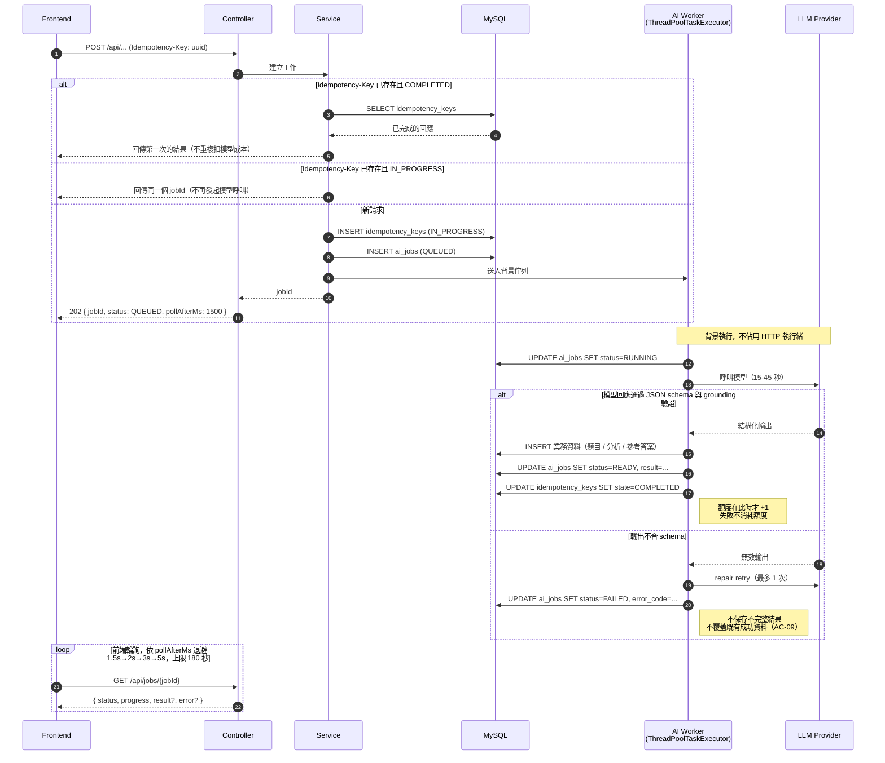
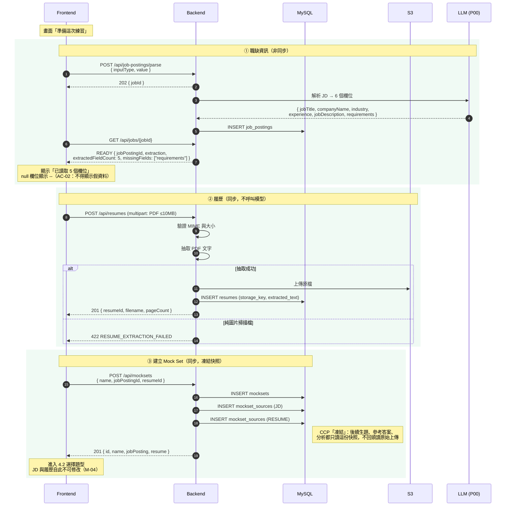
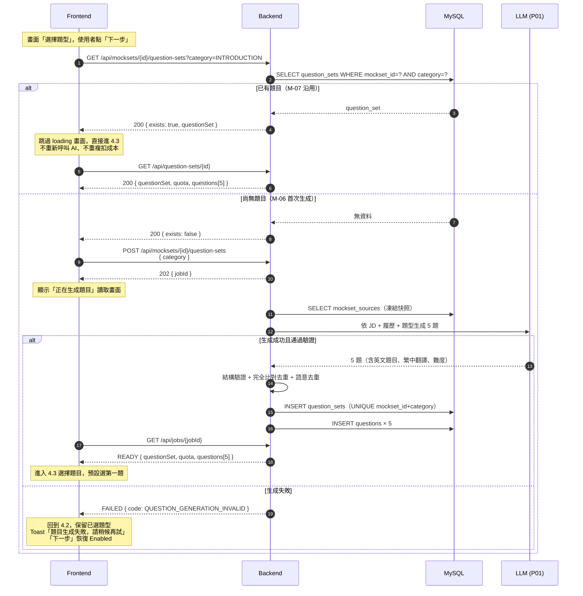
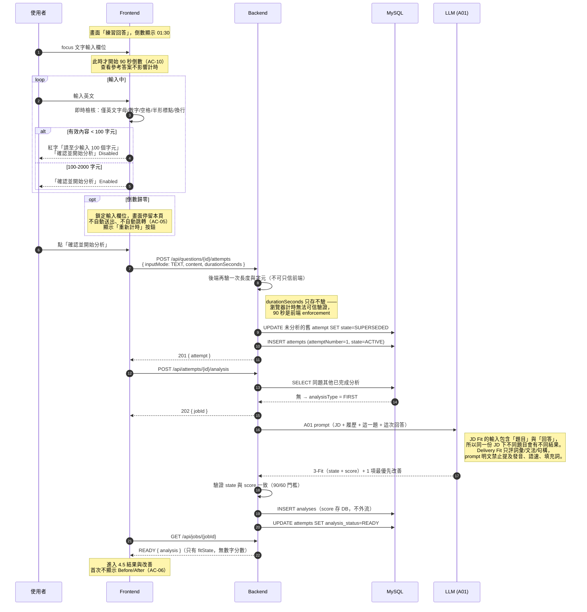
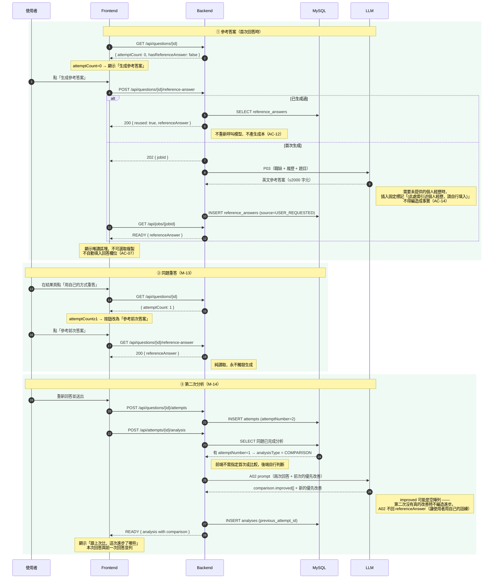
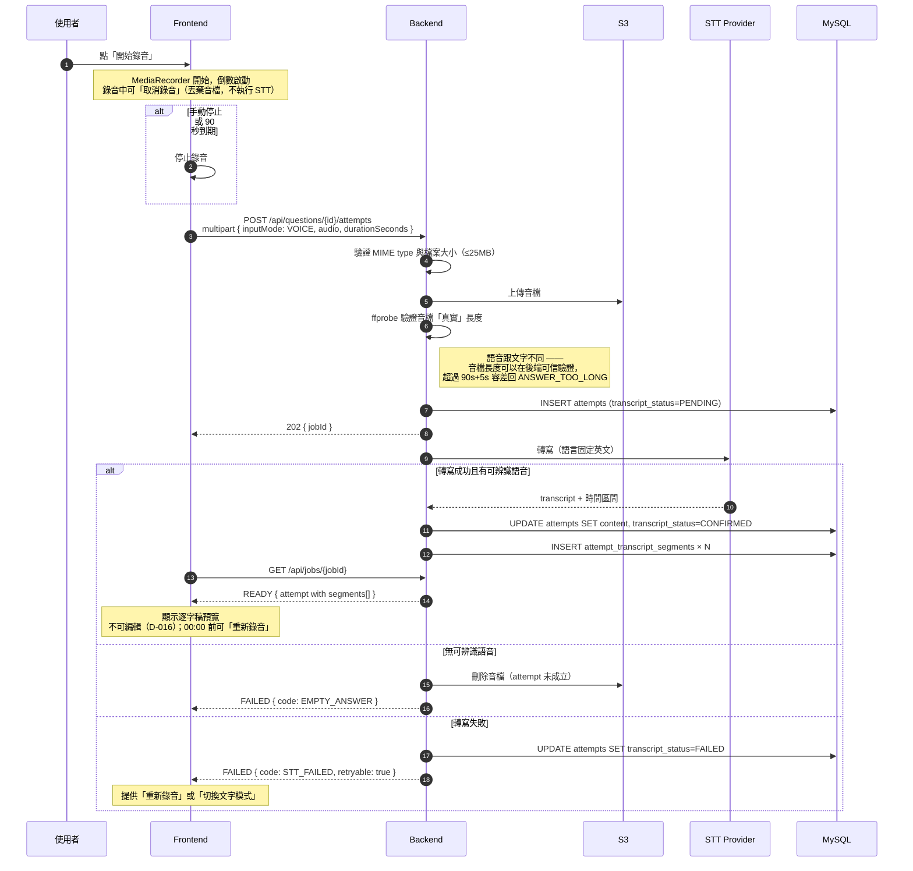
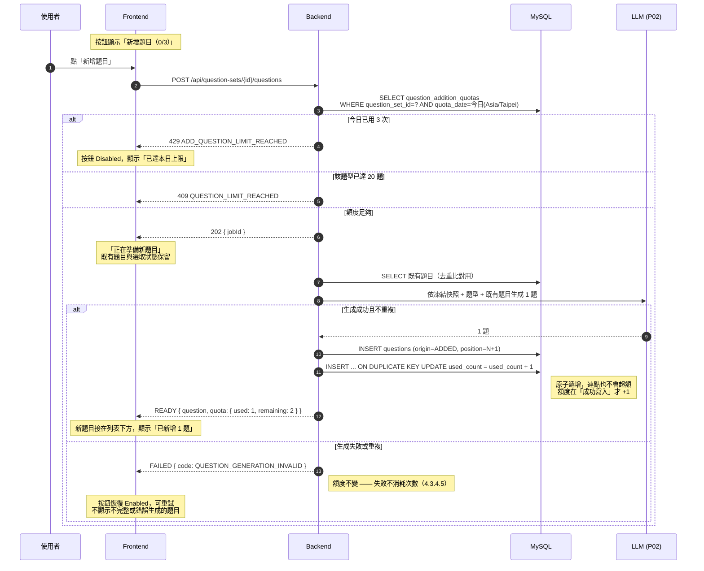
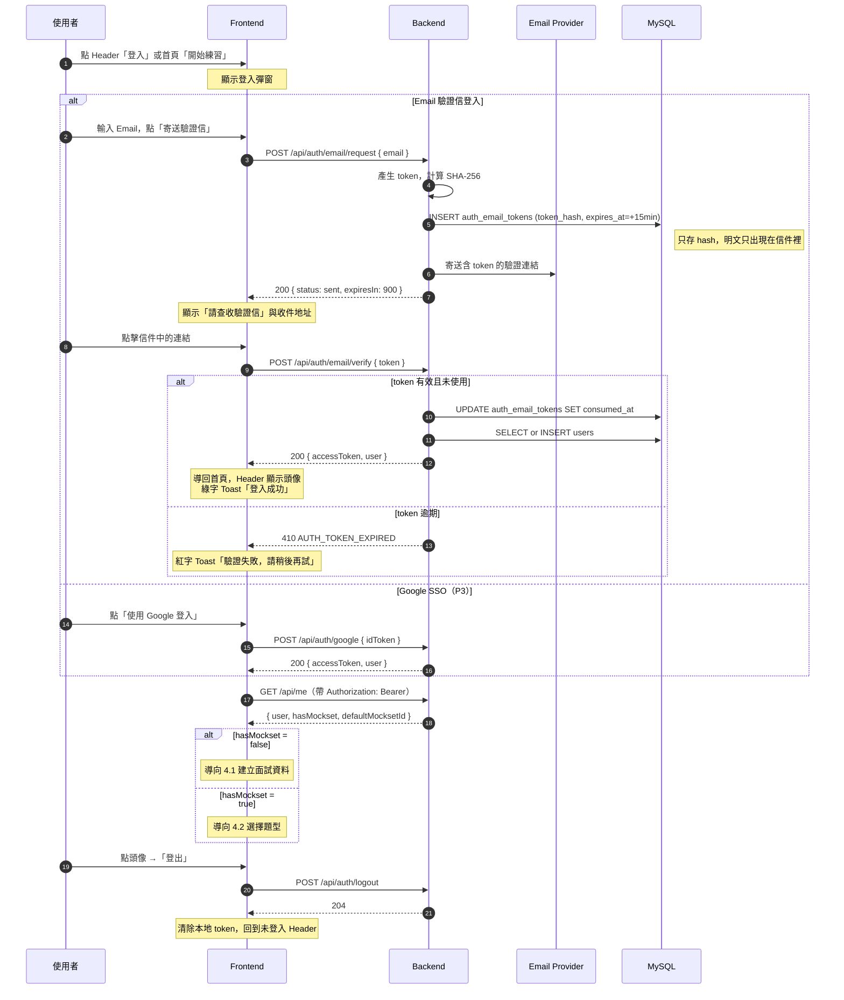
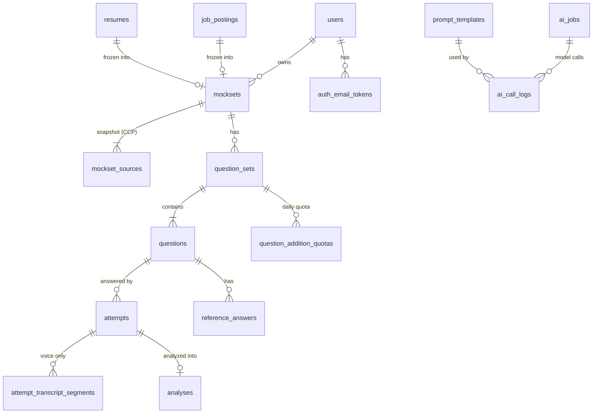

# reMockable Backend Spec

| 項目 | 值 |
|---|---|
| 版本 | **DRAFT**（待 review 後發布 0.1.0） |
| 對應產品 Spec | reMockable MVP SPEC v0.8.0 |
| 技術棧 | Java 21 / Spring Boot 3.5.5 / MySQL 8.0（AWS RDS） |
| 架構 | MVC 分層：Controller → Service → Repository |
| Base URL | `/api` |
| 機器可讀規格 | [`openapi.yaml`](./openapi.yaml) |
| Repo | https://github.com/ieieiei-thementorship/remockable-backend |

> 這份文件是**單一事實來源**：介面契約、資料模型、流程與驗收條件都在這裡，依功能編號分節。
> `openapi.yaml` 是由本文件衍生的機器可讀產物，供前端匯入 Postman／產生 client。

---

## 給審閱者

感謝撥空審閱。本文件是後端的單一事實來源，以下先整理出**需要您協助判斷的 2 件事**，
其餘章節為已定案的契約與資料模型，供查閱與確認。

**需要您協助判斷的 2 件事**

| # | 議題 | 在哪 | 為什麼需要您 |
|---|---|---|---|
| 1 | **AI Provider 與模型選型** | issue #6 | spec 未指定廠商，目前擋住 6 支 AI endpoint 與 10 份 prompt。我們目前的方向是：LLM 走 NVIDIA NIM（38 個免費端點、OpenAI 相容 REST），STT 排除 NVIDIA（其 ASR 走 gRPC，Java 需自編 proto）改用 Groq 或 AWS Transcribe。**想請您確認這個方向是否合理** |
| 2 | **非同步用單機 executor** | §1.3 | Phase 1 採 `ThreadPoolTaskExecutor`，是 9/10 期限下最快上線的做法；設計上之後換 SQS + 獨立 worker 時，controller 與輪詢契約都不需更動。**想請您確認這個取捨是否可接受** |

**已定案、不需再討論**

| 議題 | 決定 | 出處 |
|---|---|---|
| **資料表建置策略** | **一次建 18 張**，不分 Phase migrate。RDS 加欄位需停機窗口，而語音、`user_id`、quota 這些欄位現在就確定會用到 | 2026-09-05 |
| **檔案上傳方式** | **前端以 multipart 直接送檔案給後端，後端寫入 S3**。不採 presigned URL 前端直傳，也不採「前端傳 URL、後端去抓」—— 後者無法在抓取前驗證檔案大小，且會引入 SSRF 風險 | 2026-09-05 |
| **Auth token 格式** | **Opaque 隨機字串**，DB 只存 SHA-256。沿用 `auth_email_tokens` 既有模式，**登出可真正失效**（JWT 需另建黑名單才做得到） | 2026-09-05 |
| 參考答案一份/兩份 | 一份 | issue #3 |
| Mock Set 數量 | 先做 1 組 | issue #3 |
| P1 首頁導向 | 不擋登入 | issue #3 |
| JD Fit 定義 | 回答 vs JD，Resume 僅供查證 | issue #3 |
| D-011 文案 | backend 已就緒，文案屬 PM／設計 | issue #3 |
| 90 秒計時 | 前端 UI 倒數，後端只驗長度 | issue #3 |
| Delivery Fit 範圍 | 本輪只評文字與文法（PRD 五構面中的 3.1、3.5） | 2026-09-05 |

**仍 open，但不阻塞 P1A / P1B 開發**：資料保留期限（🟡7）、JD 來源需 PM 更新 D-006 / S-02（🟡8）。

### 建議的閱讀順序

| 若您想確認 | 建議閱讀 |
|---|---|
| 架構是否合理 | §1.3 技術架構 → §2.5 非同步 Job → §2.4 冪等 |
| 資料模型是否站得住 | §5.1 ERD → §5.2 表清單 → **§5.4 設計理由**（此節為重點） |
| 介面是否足夠前端使用 | §2 通用契約，以及 §4 各支的 Request / Response |
| 如何驗收 | §4 各支的**驗收條件** —— 共 116 條，同時也是 TDD 的測試清單 |

> **前端拿到的是本文件的子集**（§2 通用契約 + §3 流程圖 + §4 功能規格），
> 以 `docs/api-interface.html` 與其 PDF 交付，由 `scripts/gen_api_chapter.py`
> 從本文件與 `openapi.yaml` 產生，因此兩份不會漂移。**資料表定義不提供給前端。**

---

## 目錄

- [給審閱者](#給審閱者)
- [1. 系統概觀](#1-系統概觀)
- [2. 通用契約](#2-通用契約)
- [3. 流程圖](#3-流程圖)
- [4. 功能規格](#4-功能規格)
- [5. 資料表定義](#5-資料表定義)
- [6. 待 PM 確認事項](#6-待-pm-確認事項)

---

# 1. 系統概觀

## 1.1 產品迴圈

```
建立 Mock Set（JD + 履歷）
  → 選題型（4 選 1）
  → AI 生成 5 題
  → 選 1 題
  → 90 秒回答（文字 / 語音）
  → 3-Fit 分析 + 1 項最優先改善
  → 同題重答
  → Before / After 比較
```

MVP 要驗證的不是完整產品，而是「回答 → 診斷 → 救援 → 重答」這個循環是否真的有效。

## 1.2 Phase 與交付

| Phase | 交付日 | 範圍 | 後端工作 |
|---|---|---|---|
| **P1A** | 9/10 | **以無帳號流程驗證**。JD 文字 + PDF 履歷 → 建立 Mock Set → 解析職缺 → 選題型 → 生 5 題 → 選一題 | §4.1–§4.5 |
| **P1B** | 9/10 | 文字回答 → 90 秒限制 → 首次分析（3-Fit + 優先改善） | §4.6、§4.9 |
| **P2A** | 9/17 | 沿用題目、AI 生成 Reference Answer、同題重答 Before/After | §4.5.1、§4.8、§4.9 |
| **P2B** | 9/17 | 語音回答 → STT → 逐字稿 → 分析；新增題目 | §4.7、§4.6.2 |
| **P2C** | 9/17 | User 登入 / 登出 | §4.10 |
| **P3** | 9/23 | Google SSO、多組 Mock Set、Protected Preview、Event Log、**Portfolio PDF 與補充文字**（Figma Step 1 標為選填，MVP 不做） | §4.10、§4.11 |

> **實作順序建議與 Phase 不完全相同。** M-11 首次分析（P1B）與 M-14 第二次分析（P2A）
> 是同一支 API，只差 prompt 用 A01 還是 A02；M-07 沿用題目（P2A）就是 P1A 那支查詢的
> 自然結果。**把它們拆開做等於同一支 API 寫兩次。** 真正該獨立切出來的是 P2B 的語音。

## 1.3 技術架構

```
┌─────────────┐   HTTPS    ┌──────────────────────────────────┐
│  Frontend   │──────────▶ │  Spring Boot 3.5.5 (Java 21)     │
│  React RWD  │            │                                   │
│  (Pages)    │◀────────── │  Controller  ← REST, DTO 驗證     │
└─────────────┘  CommonResp│      ↓                            │
                           │  Service     ← 業務規則、冪等      │
                           │      ↓                            │
                           │  Repository  ← Spring Data JPA    │
                           └───────┬───────────────┬───────────┘
                                   │               │
                          ┌────────▼─────┐  ┌──────▼────────┐
                          │  MySQL 8.0   │  │  AI Provider  │
                          │  (AWS RDS)   │  │  LLM / STT    │
                          └──────────────┘  └───────────────┘
                                   │
                          ┌────────▼─────┐
                          │  S3          │  履歷 PDF、音檔
                          └──────────────┘
```

**分層職責**

| 層 | 職責 | 不做什麼 |
|---|---|---|
| Controller | 路由、DTO 驗證、包裝 `CommonResp` | 不寫業務規則、不碰 Repository |
| Service | 業務規則、交易邊界、冪等、呼叫 AI Provider | 不知道 HTTP 的存在 |
| Repository | Spring Data JPA | 不寫業務判斷 |

**非同步工作**：Phase 1 用單機 `ThreadPoolTaskExecutor`（9/10 期限下最快上線）。
之後換 SQS + 獨立 worker 時只需替換送件實作，Controller 與 job 輪詢契約都不用動。

**前端形式**：純 RWD Web（產品 Spec §13.4 Mobile-first），**沒有原生 App**。
因此後端不處理 deep link、推播、App 版本相容；但需要處理 CORS 與行動網路下的輪詢退避。

---

# 2. 通用契約

## 2.1 回應包裝

### 成功（單筆）— `CommonResp<T>`

```json
{
  "timestamp": 1788289513681,
  "data": { "id": "ms_01M1F5...", "name": "PM (Northstar Labs)" }
}
```

### 成功（列表）— `CommonPageResp<T>`

```json
{
  "timestamp": 1788289513681,
  "size": null,
  "page": 0,
  "totalPages": 1,
  "total": 5,
  "data": [ { "...": "..." } ]
}
```

### 失敗 — `ErrorResp`

```json
{
  "timestamp": 1788289513927,
  "code": "JOB_PAGE_UNREADABLE",
  "messageKey": "job_input_try_paste_text",
  "retryable": true,
  "requestId": "req_01M1F5RYE0WFD915BGK9HHKPGW",
  "extra": null
}
```

| 欄位 | 說明 |
|---|---|
| `code` | 穩定機器碼（= `RespErrCode` 的 enum 名稱）。前端用它決定行為 |
| `messageKey` | 文案索引鍵。**後端不回中文句子** —— 產品 Spec §12 明訂中文文案由產品與設計共同管理 |
| `retryable` | `true` 時前端應提供「請稍候再試」與重試入口 |
| `extra` | 選填補充資訊（例如超過的位元組數） |

> ⚠️ **HTTP status 照實回，不會永遠回 200。** 把成敗塞進 body 並永遠回 200 會讓
> ALB／CloudWatch 的 5xx 告警失效、瀏覽器 devtools 看不出哪支失敗、CDN 把錯誤回應當成功快取。

**命名慣例：camelCase**（對齊 `CommonResp` / `CommonPageResp` 的 Lombok `@Data` + Jackson 預設）。

## 2.2 認證

```
Authorization: Bearer <access_token>
```

| Phase | 狀態 | 行為 |
|---|---|---|
| P1A / P1B / P2A / P2B | **optional** | 後端忽略。以無帳號流程驗證 |
| **P2C 起** | **required** | 缺少或無效回 `401 ACCESS_DENIED` |

**前端請從第一天就把這個 header 帶上**（有 token 就帶，沒有就省略），P2C 上線時不必改呼叫程式碼。
所有資料表的 `user_id` 已建好且為 nullable，P2C 開始寫入即可，不需要 migration。

## 2.3 共用 Request Header

| Header | 必要性 | 說明 |
|---|---|---|
| `Content-Type` | 視 endpoint | `application/json` 或 `multipart/form-data` |
| `Authorization` | 見 §2.2 | `Bearer <token>` |
| `Idempotency-Key` | **建議** | UUID v4。所有 `POST` 都支援 |
| `X-Request-Id` | 選填 | 前端自帶的追蹤 id；未帶則後端產生。一律回寫在 response header 與 `ErrorResp.requestId` |

## 2.4 冪等

產品 Spec §13.3 有三條硬性要求：

> - 具 idempotency key 的請求不可重複建立同一個 Attempt
> - 使用者重新整理頁面不應重複生成題目或重複扣模型成本
> - 失敗狀態可重新嘗試，但不覆蓋已成功的結果

實作：`idempotency_keys` 表 + `UNIQUE (idempotency_key, endpoint)`。
`state = IN_PROGRESS` 讓連點兩下的第二個請求回同一個 `jobId`，而不是在第一個還沒寫完時又發起模型呼叫。
`request_hash` 防止前端 bug 造成的「同一個 key 送不同內容」被誤判為重送。保留 24 小時。

## 2.5 非同步 Job

生題約 15–40 秒、分析約 20–45 秒，都超過一般 HTTP timeout，因此**所有呼叫 AI 模型的操作共用同一套非同步流程**，前端只要寫一次輪詢邏輯。

```
POST <AI endpoint>  →  202 { "timestamp":…, "data": { "jobId":"job_…", "status":"QUEUED", "pollAfterMs":1500 } }
                          ↓ 依 pollAfterMs 輪詢
GET /api/jobs/{jobId}
```

**Job 物件**

```json
{
  "timestamp": 1788289513681,
  "data": {
    "jobId": "job_01M1F5...",
    "jobType": "QUESTION_SET_GENERATION",
    "status": "RUNNING",
    "progress": 0.4,
    "elapsedMs": 12034,
    "pollAfterMs": 2000,
    "result": null,
    "error": null,
    "createdAt": "2026-09-10T02:11:07Z",
    "finishedAt": null
  }
}
```

| `status` | `result` | `error` |
|---|---|---|
| `QUEUED` / `RUNNING` | `null` | `null` |
| `READY` | 有值（形狀依 `jobType`） | `null` |
| `FAILED` | `null` | 有值（同 `ErrorResp` 的 code / messageKey / retryable） |

**輪詢規則（前端請照做）**

1. 依 response 的 `pollAfterMs` 決定下次輪詢，**不要固定 1 秒打**
2. 後端退避策略：`1500ms → 2000ms → 3000ms → 5000ms`（上限 5 秒）
3. `READY` 或 `FAILED` 即停止
4. **總輪詢上限 180 秒**，超過視同逾時
5. Job 結果保留 **24 小時**，重整頁面後仍可用同一個 `jobId` 取回

> **失敗不消耗額度**：新增題目的每日配額只在 job **成功寫入題目時**才 +1（產品 Spec 4.3.4.5）。

## 2.6 Enum

| Enum | 值 | 前端顯示 |
|---|---|---|
| `category` | `INTRODUCTION` / `BEHAVIORAL` / `TECHNICAL` / `CULTURAL_FIT` | 自我介紹 / 行為問題 / 技術問題 / 文化契合 |
| `difficulty` | `EASY` / `MEDIUM` / `HARD` | 簡單 / 中等 / 困難 |
| `inputMode` | `TEXT`（P1B）/ `VOICE`（P2B） | 文字 / 語音 |
| `fitState` | `GREEN` / `YELLOW` / `RED` | 綠 / 黃 / 紅 |
| `overallState` | `STRONG` / `ACCEPTABLE` / `NEEDS_IMPROVEMENT` | — |
| `status`（job） | `QUEUED` / `RUNNING` / `READY` / `FAILED` | — |
| `inputType`（JD） | `TEXT` / `URL` | 貼上文字 / 職缺連結 |
| `analysisType` | `FIRST` / `COMPARISON` | 首次分析 / 第二次比較 |
| `origin`（題目） | `INITIAL` / `ADDED` | 首次生成 / 使用者新增 |
| `source`（參考答案） | `USER_REQUESTED` / `FROM_ANALYSIS` | 點擊生成 / 分析產出 |

**燈號門檻**（產品 Spec D-025、AC-13）：綠燈 90 分以上／黃燈 60–89 分／紅燈未滿 60 分。

> ⚠️ **API 不回傳 numeric score。** 產品 Spec D-025 明訂「Server 保存 numeric score，UI 不顯示數字」。
> 分數存在 `analyses` 表供模型評估使用，DTO 層只映射 `*State`。

## 2.7 JD 來源支援範圍

| 來源 | 本輪狀態 |
|---|---|
| 貼上 JD 文字 | ✅ P1A 支援 |
| CakeResume 職缺連結 | ✅ P1A 支援 |
| 104 / LinkedIn 職缺連結 | ❌ 本輪不做 → 回 `JOB_URL_NOT_SUPPORTED` |

⚠️ 前端 supporting text 目前寫「可貼上 104、Cake 或 LinkedIn 連結」，**需同步改為只提 Cake**。

## 2.8 Error Code 全表

| Code | HTTP | `messageKey` | `retryable` | 前端恢復方式 |
|---|---|---|---|---|
| `JOB_PAGE_UNREADABLE` | 422 | `job_input_try_paste_text` | ✅ | 回到職缺資訊欄位：「讀取連結失敗，請重新上傳」 |
| `JOB_URL_NOT_SUPPORTED` | 422 | `job_url_not_supported` | ✅ | 提示改貼 JD 文字 |
| `JOB_TEXT_TOO_SHORT` | 422 | `job_input_too_short` | ✅ | 提示補充職缺內容 |
| `RESUME_UNSUPPORTED_TYPE` | 415 | `resume_unsupported_type` | ✅ | 「請使用 PDF」 |
| `RESUME_EXTRACTION_FAILED` | 422 | `resume_extraction_failed` | ✅ | 「請重新上傳可讀取的 PDF」 |
| `RESUME_EMPTY` | 422 | `resume_empty` | ✅ | 同上 |
| `MOCKSET_SOURCE_MISSING` | 400 | `mockset_source_missing` | ✅ | 阻止建立，回到缺少的欄位 |
| `MOCKSET_IMMUTABLE` | 409 | `mockset_immutable` | ❌ | 提示需建立新的 Mock Set |
| `MOCKSET_LIMIT_REACHED` | 409 | `mockset_limit_reached` | ❌ | P3 才啟用 |
| `QUESTION_GENERATION_INVALID` | 502 | `question_generation_retry` | ✅ | 「題目生成失敗，請稍候再試」 |
| `QUESTION_GENERATION_BLOCKED` | 422 | `question_generation_blocked` | ✅ | JD／履歷資訊不足 |
| `ADD_QUESTION_LIMIT_REACHED` | 429 | `add_question_limit_reached` | ❌ | 按鈕 Disabled：「已達本日上限」 |
| `QUESTION_LIMIT_REACHED` | 409 | `question_limit_reached` | ❌ | 該題型已達 20 題（**文案待補**） |
| `EMPTY_ANSWER` | 400 | `answer_empty` | ✅ | 不進行分析，提示重新回答 |
| `ANSWER_TOO_SHORT` | 400 | `answer_too_short` | ✅ | 「請至少輸入 100 個字元」 |
| `ANSWER_TEXT_TOO_LONG` | 400 | `answer_text_too_long` | ✅ | 達 2000 字元後不可繼續輸入 |
| `ANSWER_TEXT_INVALID_CHARS` | 400 | `answer_text_invalid_chars` | ✅ | 僅允許英文字母、數字、空格、半形標點與換行 |
| `ANSWER_TOO_LONG` | 400 | `answer_too_long` | ❌ | 音檔超過 90 秒 |
| `AUDIO_UNSUPPORTED_TYPE` | 415 | `audio_unsupported_type` | ✅ | 重新錄音 |
| `UPLOAD_TOO_LARGE` | 413 | `upload_too_large` | ✅ | 履歷 10 MB／音檔 25 MB |
| `STT_FAILED` | 502 | `stt_failed` | ✅ | 重新錄音或切換文字模式 |
| `ANALYSIS_UNAVAILABLE` | 502 | `analysis_retry` | ✅ | 留在 4.4 練習頁，「請稍候再試」 |
| `REFERENCE_ANSWER_NOT_ALLOWED` | 409 | `reference_answer_not_allowed` | ❌ | 隱藏生成按鈕 |
| `MODEL_UNAVAILABLE` | 502 | `model_unavailable` | ✅ | 「請稍候再試」 |
| `MODEL_QUOTA_EXCEEDED` | 429 | `model_quota_exceeded` | ❌ | 提示稍後再來 |
| `MODEL_OUTPUT_INVALID` | 502 | `model_output_invalid` | ✅ | 「請稍候再試」 |
| `PROVIDER_NOT_CONFIGURED` | 503 | `provider_not_configured` | ❌ | 環境問題，非使用者可恢復 |
| `AUTH_TOKEN_EXPIRED` | 410 | `auth_token_expired` | ✅ | 重新寄送驗證信 |
| `ACCESS_DENIED` | 401 | `access_denied` | ❌ | 導向登入 |
| `RATE_LIMITED` | 429 | `rate_limited` | ✅ | 稍後重試 |
| `IDEMPOTENCY_CONFLICT` | 409 | `idempotency_conflict` | ✅ | 同一請求處理中，稍候 |
| `VALIDATION_ERROR` | 400 | `validation_error` | ✅ | 回到對應欄位 |
| `NOT_FOUND` | 404 | `not_found` | ❌ | — |
| `INTERNAL_ERROR` | 500 | `internal_error` | ✅ | 「請稍候再試」 |

---

# 3. 流程圖

## 3.1 非同步 Job 的通用機制（所有 AI 呼叫共用）

這是理解後面所有流程的前提。冪等與額度扣抵的時機都在這裡決定。



## 3.2 P1A — 建立 Mock Set（產品 Spec 4.1）



## 3.3 P1A / P2A — 選擇題型與生成題目（M-06 生成、M-07 沿用）



## 3.4 P1B — 文字回答與首次分析（M-09、M-11）



## 3.5 P2A — 參考答案、同題重答與比較分析（M-12、M-13、M-14）



## 3.6 P2B — 語音回答與 STT（M-09 voice、M-10）



## 3.7 P2B — 新增題目與每日額度（M-18）



## 3.8 P2C — 登入 / 登出（M-17）



---

# 4. 功能規格

每節對應產品 Spec 的 Must Have 編號。

> ### ⚠️ 讀本章前務必先看這段
>
> **本章所有標示「Response」的 JSON 都只是 `data` 的內容，不是完整回應。**
> 實際收到的每一個成功回應都多包一層 `CommonResp`：
>
> ```json
> {
>   "timestamp": 1788289513681,
>   "data": { ...本章列出的內容... }
> }
> ```
>
> 前端要取的是 `res.data.resumeId`，**不是** `res.resumeId`。列表型 endpoint
> 包的是 `CommonPageResp`（多了 `page` / `size` / `total` / `totalPages`），見 §2.1。
>
> 標示「**Job result**」的則是再往內一層 —— 那是 `GET /api/jobs/{jobId}` 回應中的
> `data.result`，要輪詢到 `status: "READY"` 才拿得到：
>
> ```json
> {
>   "timestamp": 1788289528440,
>   "data": {
>     "jobId": "job_01M1F5...", "status": "READY", "elapsedMs": 21406,
>     "result": { ...本章標示 Job result 的內容... }
>   }
> }
> ```
>
> 錯誤一律是 `ErrorResp` + 對應的 HTTP status，不會被包進 `CommonResp`。

## 4.0 Meta

### `GET /api/health`

無需認證。前端啟動時讀一次，**`limits` 是前端驗證規則的唯一來源**，不要把數字寫死在程式碼裡。

**Response** — `CommonResp.data` 內容

```json
{
  "status": "ok", "service": "remockable-api", "version": "0.1.0", "uptimeSeconds": 8241,
  "providers": { "llm": { "configured": true }, "stt": { "configured": true } },
  "limits": {
    "maxResumeBytes": 10000000, "maxAudioBytes": 25000000, "maxAnswerSeconds": 90,
    "minAnswerChars": 100, "maxAnswerChars": 2000,
    "dailyAddQuestionLimit": 3, "maxQuestionsPerCategory": 20
  }
}
```

**驗收條件**

- [ ] 回 200，`data.status` 為 `ok`
- [ ] `data.limits` 六個數值與 application.yml 的設定一致
- [ ] provider 未設定金鑰時 `data.providers.llm.configured` 為 false，且不洩漏金鑰內容
- [ ] 不需要 Authorization 也能呼叫

### `GET /api/jobs/{jobId}`

輪詢任何非同步工作。形狀見 §2.5。`404 NOT_FOUND` = 不存在或已超過 24 小時保留期。

**驗收條件**

- [ ] QUEUED / RUNNING 時 `result` 與 `error` 皆為 null
- [ ] READY 時 `result` 有值、`error` 為 null；FAILED 時相反
- [ ] `pollAfterMs` 依 1500 → 2000 → 3000 → 5000 遞增，不超過 5000
- [ ] jobId 不存在回 404 `NOT_FOUND`
- [ ] job 建立超過 24 小時後回 404

---

## 4.1 M-01 / M-02 職缺資訊解析（P1A）


### `POST /api/job-postings/parse` — 非同步

**Request body**

```json
{ "inputType": "TEXT", "value": "We are looking for a Product Manager..." }
```

後端也會自行判斷 `value` 是否為有效 http/https URL；與 `inputType` 不符時**以實際內容為準**，
並在 job result 回傳實際使用的 `inputType`。

**Job result**（`jobType: "JOB_POSTING_PARSE"`）

**Job result** — `GET /api/jobs/{jobId}` 的 `data.result`

```json
{
  "jobPostingId": "jp_01M1F5...",
  "inputType": "TEXT",
  "sourceUrl": null,
  "extraction": {
    "jobTitle": "Product Manager",
    "companyName": "Northstar Labs",
    "industry": "SaaS / B2B 軟體",
    "experience": "3 年以上產品管理經驗",
    "jobDescription": "負責產品策略、使用者研究與跨團隊協作…",
    "requirements": null
  },
  "extractedFieldCount": 5,
  "missingFields": ["requirements"]
}
```

> **無法擷取的欄位一律回 `null`**，不回空字串、不回預設值、不編造內容（D-021、AC-02）。
> 前端把 `null` 顯示為 `--`。`extractedFieldCount` 直接用在「已讀取 x 個欄位」。

> ⚠️ **網域白名單同時是 SSRF 防線，不只是 MVP 範圍限制。**
> 這是全系統**唯一**由後端主動對外發出 HTTP 請求的地方（其餘上傳一律走 multipart，
> 後端不去抓使用者給的網址）。若不限制網域，使用者可貼
> `http://169.254.169.254/`（雲端 metadata endpoint）或內網位址，
> 讓後端代為存取。實作時除了比對網域，還要：
>
> - 解析後的 IP 落在私有網段（10/8、172.16/12、192.168/16、127/8、169.254/16）一律拒絕
> - 禁止跟隨跨網域重導
> - 設定抓取逾時與回應大小上限

**錯誤**：`JOB_PAGE_UNREADABLE`（URL 讀不到）、`JOB_URL_NOT_SUPPORTED`（非 Cake 網域）、
`JOB_TEXT_TOO_SHORT`、`MODEL_UNAVAILABLE`

**驗收條件**

- [ ] 合法輸入回 202，body 含 `jobId` 與 `pollAfterMs`
- [ ] 輪詢到 READY 時，`result.extraction` 六個欄位齊全（擷取不到者為 null，不是空字串）
- [ ] `extractedFieldCount` 等於非 null 欄位數，`missingFields` 等於 null 欄位名清單
- [ ] `inputType: TEXT` 但 value 是 http/https URL 時，以 URL 處理，且 result 回傳實際使用的 `inputType`
- [ ] 文字少於 120 字元回 422 `JOB_TEXT_TOO_SHORT`
- [ ] 非 CakeResume 網域回 422 `JOB_URL_NOT_SUPPORTED`
- [ ] URL 解析後的 IP 落在私有網段（10/8、172.16/12、192.168/16、127/8、169.254/16）一律拒絕
- [ ] 不跟隨跨網域重導
- [ ] 抓取設有逾時與回應大小上限
- [ ] 連結讀不到內容時 job 轉 FAILED，`error.code` 為 `JOB_PAGE_UNREADABLE` 且 `retryable` 為 true
- [ ] 相同 `Idempotency-Key` 與相同內容重送，回同一個 `jobId`，模型只被呼叫一次

### `GET /api/job-postings/{id}`

重整頁面後重新取得解析結果。回傳與 job result 相同的物件。

**驗收條件**

- [ ] 回傳與 job result 相同形狀的物件（重整頁面可取回）
- [ ] id 不存在回 404 `NOT_FOUND`

---

## 4.2 M-03 履歷上傳（P1A）


### `POST /api/resumes` — 同步

`multipart/form-data`，欄位 `file`。**僅接受 PDF，≤ 10 MB。** 不呼叫 AI 模型，通常 < 2 秒。

**Response** — `CommonResp.data` 內容

```json
{
  "resumeId": "res_01M1F5...", "filename": "andre-hung-resume-2026.pdf",
  "byteSize": 842113, "pageCount": 2, "extractedCharCount": 4821, "status": "READY"
}
```

**錯誤**：`RESUME_UNSUPPORTED_TYPE`(415)、`UPLOAD_TOO_LARGE`(413)、
`RESUME_EXTRACTION_FAILED`(422，例如純圖片掃描檔)、`RESUME_EMPTY`(422)

**驗收條件**

- [ ] 上傳合法 PDF 回 201，`data.resumeId` 有值、`status` 為 `READY`
- [ ] `extractedCharCount` 大於 0 且與實際抽取字數一致
- [ ] 非 PDF（如 docx、png）回 415 `RESUME_UNSUPPORTED_TYPE`
- [ ] 超過 10 MB 回 413 `UPLOAD_TOO_LARGE`
- [ ] 純圖片掃描檔（抽不出文字）回 422 `RESUME_EXTRACTION_FAILED`
- [ ] 抽出字數為 0 回 422 `RESUME_EMPTY`
- [ ] 履歷原文不得出現在任何 application log

---

## 4.3 M-01 / M-04 建立 Mock Set（P1A）


### `POST /api/mocksets` — 同步

**Request body**

```json
{ "name": "PM (Northstar Labs)", "jobPostingId": "jp_01M1F5...", "resumeId": "res_01M1F5..." }
```

| 欄位 | 規則 |
|---|---|
| `name` | 必填，**至少 2 字元**。建立後不可修改 |
| `jobPostingId` / `resumeId` | 必填，來自 §4.1 / §4.2 |

**回應**

**Response** — `CommonResp.data` 內容

```json
{
  "id": "ms_01M1F5...", "name": "PM (Northstar Labs)", "status": "READY",
  "jobPosting": { "id": "jp_...", "jobTitle": "Product Manager", "companyName": "Northstar Labs",
                  "industry": "SaaS / B2B 軟體", "experience": "3 年以上產品管理經驗",
                  "jobDescription": "…", "requirements": null, "sourceUrl": null },
  "resume": { "id": "res_...", "filename": "andre-hung-resume-2026.pdf" },
  "createdAt": "2026-09-10T02:11:07Z"
}
```

> **沒有 `PATCH /mocksets/{id}`。** M-04／D-003：建立後 JD 與履歷不可修改，要換資料只能建新的。
> 建立時同步寫入 `mockset_sources` 凍結快照（CCP 步驟 4）。

⚠️ **`name` 是使用者輸入的練習名稱，不是 JD 解析出的職稱。** 職稱在 `jobPosting.jobTitle`。
產品 Spec §4.7.2 特別區分過這兩者，實作時很容易搞混。

**驗收條件**

- [ ] 合法輸入回 201，`data.mocksetId` 有值
- [ ] `mockset_sources` 同時寫入 JD 與履歷的凍結快照
- [ ] 快照建立後，即使原 `job_postings` 被更新，該 Mock Set 讀到的仍是快照內容
- [ ] `name` 少於 2 字元回 400 `VALIDATION_ERROR`
- [ ] `jobPostingId` 或 `resumeId` 不存在回 400 `MOCKSET_SOURCE_MISSING`
- [ ] 沒有提供 PATCH／PUT endpoint（建立後不可修改）

### `GET /api/mocksets` — `CommonPageResp`（P3）

**驗收條件**

- [ ] 回 `CommonPageResp`，含 `page` / `total` / `totalPages`
- [ ] 無資料時 `data` 為空陣列而非 null，且仍回 200

### `GET /api/mocksets/{id}`

取回單一 Mock Set 與其凍結快照摘要。

> P1A 無帳號流程下，前端請把 `mocksetId` 存在 `localStorage`，這是重整頁面後找回進度的唯一方法。
> P2C 登入上線後改由 `GET /api/me` 的 `defaultMocksetId` 提供。

**驗收條件**

- [ ] 回傳 Mock Set 與其凍結快照摘要
- [ ] id 不存在回 404 `NOT_FOUND`

### `DELETE /api/mocksets/{id}`（P3）

刪除 Mock Set。關聯的題目集、題目、回答、分析一併刪除（`ON DELETE CASCADE`）。

**驗收條件**

- [ ] 回 204，無 body
- [ ] 關聯的 question_sets / questions / attempts / analyses 一併刪除（ON DELETE CASCADE）
- [ ] 重複刪除同一個 id 回 404 `NOT_FOUND`

---

## 4.4 M-05 選擇題型（P1A）

純前端狀態，無 API。四種題型見 §2.6 的 `category`，預設選取 `INTRODUCTION`，一次只能選一種（D-007）。

---

## 4.5 M-06 / M-07 生成與沿用題目（P1A / P2A）


### `GET /api/mocksets/{id}/question-sets` — 同步

使用者在 4.2 點「下一步」時，**前端請先呼叫這支**。已有題目就直接進 4.3，跳過 loading，也不重複扣模型成本。

**參數**

| 參數 | 位置 | 必要性 | 型別 | 說明 |
|---|---|---|---|---|
| `id` | path | 必填 | string | Mock Set id，例 `ms_01M1F5...` |
| `category` | **query** | **必填** | enum | `INTRODUCTION` / `BEHAVIORAL` / `TECHNICAL` / `CULTURAL_FIT` |

> `category` 是**網址後面的 query string，不是 header**。缺少或值不在上述四個之內回 `VALIDATION_ERROR`(400)。

```
GET /api/mocksets/ms_01M1F5RYE0WFD915BGK9HHKPGW/question-sets?category=INTRODUCTION
```

**Response** — `CommonResp.data` 內容

```json
{ "exists": true, "questionSet": { "id": "qs_01M1F5...", "category": "INTRODUCTION", "questionCount": 5 } }
```

> 刻意用 `200 + exists:false` 而非 `404`，讓前端不必把「還沒生成」當成錯誤處理。

**驗收條件**

- [ ] 該題型已有題目回 200 且 `exists` 為 true，附 `questionSet`
- [ ] 尚未生成回 **200** 且 `exists` 為 false —— **不是 404**
- [ ] 缺少 `category` query 參數回 400 `VALIDATION_ERROR`
- [ ] `category` 不在四個列舉值內回 400 `VALIDATION_ERROR`
- [ ] 此 endpoint 永不呼叫模型（可用 provider 呼叫次數斷言）

### `POST /api/mocksets/{id}/question-sets` — 非同步

`{ "category": "INTRODUCTION" }` → `202 { jobId }`。
若已有題目，直接回 `200 { status: "READY", questionSetId, reused: true }`，**不重新生成**（M-07）。

**Job result**（`jobType: "QUESTION_SET_GENERATION"`）

**Job result** — `GET /api/jobs/{jobId}` 的 `data.result`

```json
{
  "questionSet": { "id": "qs_01M1F5...", "mocksetId": "ms_...", "category": "INTRODUCTION",
                   "status": "READY", "questionCount": 5 },
  "quota": { "used": 0, "limit": 3, "remaining": 3, "resetAt": "2026-09-11T00:00:00+08:00" },
  "questions": [
    { "id": "q_01M1F5...", "position": 1,
      "questionText": "Why are you interested in this Product Manager role?",
      "questionTranslation": "你為什麼對這個產品經理職位有興趣？",
      "difficulty": "EASY", "origin": "INITIAL",
      "attemptCount": 0, "hasReferenceAnswer": false }
  ]
}
```

> `questionTranslation` 是繁體中文翻譯，顯示在題目卡 supporting text（D-031、AC-11）。
> `position` 從 1 開始，前端顯示為兩位數編號 `01`、`02`……

**失敗**：`QUESTION_GENERATION_INVALID`（輸出不合 schema，後端已 repair retry 一次）、
`QUESTION_GENERATION_BLOCKED`（JD／履歷資訊不足，D-022）、`MODEL_QUOTA_EXCEEDED`。
前端回到 4.2，保留已選題型，Toast「題目生成失敗，請稍候再試」，按鈕恢復 Enabled。

**驗收條件**

- [ ] 該題型尚無題目時回 202 + `jobId`；輪詢到 READY 後 `questions` 恰為 5 題
- [ ] 該題型已有題目時回 **200** 且 `reused` 為 true，**不呼叫模型**（M-07）
- [ ] 生成的題目使用凍結快照，而非 `job_postings` 的即時內容
- [ ] 同一 `(mocksetId, category)` 併發送兩次，只會建立一組 question_set（UNIQUE 約束）
- [ ] 模型輸出不合 schema 時，後端 repair retry 一次；仍失敗則 job FAILED、`error.code` 為 `QUESTION_GENERATION_INVALID`
- [ ] JD／履歷資訊不足時回 `QUESTION_GENERATION_BLOCKED`，不產出低品質題目

### `GET /api/question-sets/{id}` — 同步

回傳與上方 job result 相同形狀。

**驗收條件**

- [ ] 回傳題目集與其題目列表，依 `position` 由小到大排序
- [ ] id 不存在回 404 `NOT_FOUND`

---

## 4.6 M-08 / M-18 選擇與新增題目


### `GET /api/questions/{id}`

**Response** — `CommonResp.data` 內容

```json
{
  "id": "q_01M1F5...", "questionSetId": "qs_...", "mocksetId": "ms_...",
  "category": "INTRODUCTION", "position": 1,
  "questionText": "Why are you interested in this Product Manager role?",
  "questionTranslation": "你為什麼對這個產品經理職位有興趣？",
  "difficulty": "EASY", "attemptCount": 1, "latestAttemptId": "att_...",
  "hasReferenceAnswer": true, "referenceAnswerSource": "USER_REQUESTED"
}
```

> **`attemptCount` 決定 4.4 顯示哪個按鈕**：`0` → 「生成參考答案」；`≥1` → 「參考前次答案」（4.4.4.6）。

**驗收條件**

- [ ] `attemptCount` 與該題實際 attempt 筆數一致
- [ ] `hasReferenceAnswer` 反映 reference_answers 是否有該題資料
- [ ] id 不存在回 404 `NOT_FOUND`

### `POST /api/question-sets/{id}/questions` — 非同步（P2B，M-18）

每次新增 **1 題**。每日上限 **3 題**，以「Mock Set＋題型」為單位，日界線用 **Asia/Taipei**。

**Job result** — `GET /api/jobs/{jobId}` 的 `data.result`

```json
{
  "question": { "id": "q_01M1F6...", "position": 6, "questionText": "…",
                "questionTranslation": "…", "difficulty": "HARD", "origin": "ADDED",
                "attemptCount": 0, "hasReferenceAnswer": false },
  "quota": { "used": 1, "limit": 3, "remaining": 2, "resetAt": "2026-09-11T00:00:00+08:00" }
}
```

**錯誤**

| Code | 情境 | 前端 |
|---|---|---|
| `ADD_QUESTION_LIMIT_REACHED`(429) | 當日已成功新增 3 題 | 按鈕 Disabled，「已達本日上限」 |
| `QUESTION_LIMIT_REACHED`(409) | 該題型已達 20 題（D-011） | **文案待 PM 補**，見 §6 |
| `QUESTION_GENERATION_INVALID` | 生成失敗 | 按鈕恢復 Enabled。**不消耗當日額度** |

**驗收條件**

- [ ] 本日額度未滿時回 202；輪詢到 READY 後新增恰好 1 題，`origin` 為 `ADDED`
- [ ] `quota.used` 只在題目成功寫入後 +1；job FAILED 時額度不變
- [ ] 本日已用滿 3 次回 429 `ADD_QUESTION_LIMIT_REACHED`
- [ ] 該題型已達 20 題回 409 `QUESTION_LIMIT_REACHED`
- [ ] 額度以 Asia/Taipei 為日界線，`quota.resetAt` 為當地午夜
- [ ] 新題目與既有題目不重複（prompt 帶入既有題目做去重）

---

## 4.7 M-09 / M-10 練習回答（P1B 文字 / P2B 語音）


### `POST /api/questions/{id}/attempts`

**文字模式（P1B）— `application/json`，同步回 `201`**

**Request body**

```json
{ "inputMode": "TEXT", "content": "I am interested in this role because …", "durationSeconds": 78 }
```

| 欄位 | 規則 |
|---|---|
| `content` | 有效內容 **100–2000 字元**；僅允許英文字母、數字、空格、半形標點與換行（4.4.4.1） |
| `durationSeconds` | 前端計時秒數，供分析參考。**後端不用它擋送出** |

**語音模式（P2B）— `multipart/form-data`，非同步回 `202`**

欄位 `inputMode=VOICE`、`audio`（≤ 25 MB，支援 webm/ogg/mp4/mpeg/wav）、`durationSeconds`。

**Attempt 物件**

**Response** — `CommonResp.data` 內容

```json
{
  "id": "att_01M1F5...", "questionId": "q_...", "attemptNumber": 1, "inputMode": "VOICE",
  "content": "I am interested in this role because I have shipped two B2B products.",
  "segments": [
    { "seq": 1, "startMs": 0,    "endMs": 4200, "text": "I am interested in this role" },
    { "seq": 2, "startMs": 4200, "endMs": 9800, "text": "because I have shipped two B2B products." }
  ],
  "durationSeconds": 78, "transcriptStatus": "CONFIRMED",
  "analysisStatus": "PENDING", "state": "ACTIVE", "createdAt": "2026-09-10T02:31:44Z"
}
```

> ⚠️ **90 秒限制：後端只驗文字長度，不驗時間。**
> `durationSeconds` 由瀏覽器提供，無法可信驗證。90 秒倒數是**前端 enforcement**：
> 到 00:00 鎖定輸入欄位、不自動送出、不自動跳轉（AC-05）。
> **語音則不同** —— 後端用 ffprobe 驗證音檔真實長度，超過 90s+5s 容差回 `ANSWER_TOO_LONG`。

> `segments` 是逐字稿時間序，文字模式回空陣列。4.5「本次回答」要顯示語音的對應時間區間就靠它。
> 逐字稿**不可編輯**（D-016、M-10），API 沒有提供修改的方法。

> **重錄取代規則**：同一題在分析完成前重新送出，舊的未分析 attempt 標為 `SUPERSEDED`，
> `attemptNumber` 不跳號（§17.2：成功送出分析時才保存 Attempt）。

**驗收條件**

- [ ] 文字模式合法輸入回 **201**，`data.attemptId` 有值
- [ ] 語音模式回 **202** + `jobId`，輪詢到 READY 後 `transcriptStatus` 為 `CONFIRMED`
- [ ] `attemptNumber` 從 1 起連續遞增且不跳號
- [ ] 文字內容少於 100 字元回 400 `ANSWER_TOO_SHORT`，多於 2000 回 400 `ANSWER_TEXT_TOO_LONG`
- [ ] 含非允許字元（如中文）回 400 `ANSWER_TEXT_INVALID_CHARS`
- [ ] 空內容回 400 `EMPTY_ANSWER`
- [ ] **後端獨立重驗長度與字元，不信任前端**（可用繞過前端的直接呼叫驗證）
- [ ] 音檔非支援格式回 415 `AUDIO_UNSUPPORTED_TYPE`，超過 25 MB 回 413 `UPLOAD_TOO_LARGE`
- [ ] 音檔實際長度以 ffprobe 驗證，超過 90 秒回 400 `ANSWER_TOO_LONG`
- [ ] STT 失敗時 job FAILED、`error.code` 為 `STT_FAILED`，且**不建立半殘的 attempt**
- [ ] 回答全文與逐字稿不得出現在任何 application log

### `GET /api/attempts/{id}`

**驗收條件**

- [ ] 文字模式的 `segments` 為空陣列，語音模式有值且 `startMs` 遞增
- [ ] id 不存在回 404 `NOT_FOUND`

### `GET /api/questions/{id}/attempts` — `CommonPageResp`

4.5「前一次回答」用。只回 `state = ACTIVE`，依 `attemptNumber` 升冪。保存上限 100 筆／題。

**驗收條件**

- [ ] 回 `CommonPageResp`，依 `attemptNumber` 排序
- [ ] 無回答時 `data` 為空陣列，仍回 200

---

## 4.8 M-12 參考答案（P2A）


### `POST /api/questions/{id}/reference-answer` — 非同步

已存在則直接 `200 { status: "READY", reused: true, referenceAnswer }`，**不重新呼叫模型**（AC-12）。

**Job result** — `GET /api/jobs/{jobId}` 的 `data.result`

```json
{
  "referenceAnswer": {
    "questionId": "q_...", "source": "USER_REQUESTED",
    "text": "I am drawn to this role because (此處需引述個人經歷，請自行填入) …",
    "outline": ["點出動機", "連結一段具體經歷", "收在對這個職缺的價值"],
    "practiceTip": "先說做法，再說結果。",
    "requiresUserFill": true,
    "placeholders": ["(此處需引述個人經歷，請自行填入)"],
    "isEditable": false,
    "createdAt": "2026-09-10T02:29:12Z"
  }
}
```

| 欄位 | 說明 |
|---|---|
| `text` | 英文參考答案，**最多 2000 字元**（含空格換行，§17.4） |
| `requiresUserFill` | `true` 表示含 placeholder，前端提示使用者自行補上個人經歷 |
| `placeholders` | 固定標記。**AI 不得編造使用者未提供的經歷、成果或指標**（AC-14、§4.7.4） |
| `isEditable` | 恆為 `false`。不可選取、複製或編輯（D-018、AC-12） |

**驗收條件**

- [ ] 尚未生成時回 202；輪詢到 READY 後 `referenceAnswer.text` 不超過 2000 字元
- [ ] 已存在時回 **200** 且 `reused` 為 true，**不呼叫模型**（AC-12）
- [ ] `isEditable` 恆為 false
- [ ] 含 placeholder 時 `requiresUserFill` 為 true 且 `placeholders` 非空
- [ ] **輸出不得出現使用者未提供的公司名、職稱、數字成果**（AC-14）

### `GET /api/questions/{id}/reference-answer`

**純讀取，永遠不觸發生成、不呼叫模型、不產生成本。** 對應「參考前次答案」。
`404 NOT_FOUND` = 尚未生成過。

**同一題只會有一份參考答案。** 已與 PM 對齊（見 issue #3）：不論它是使用者主動
點「生成參考答案」產生的，還是 A01 分析輸出 `priorityImprovement.referenceAnswer`
帶出來的，**先產生的那份就是這一題的參考答案，之後不重新生成第二份**。

`source` 欄位仍保留，用來記錄它從哪裡來（供追溯與評估用），**但不影響取用邏輯**：

| `source` | 代表 |
|---|---|
| `USER_REQUESTED` | 使用者在練習頁主動點「生成參考答案」時產生 |
| `FROM_ANALYSIS` | 由 A01 分析輸出帶出 |

**前端不需要判斷 `source`，拿到什麼就顯示什麼。**
資料表為 `UNIQUE(question_id)` —— 一題一份，天然冪等。

**驗收條件**

- [ ] **永不觸發生成、永不呼叫模型**（可用 provider 呼叫次數斷言）
- [ ] 一題只會有一份（`UNIQUE(question_id)`）—— 併發送兩次生成請求只會寫入一筆
- [ ] 已有參考答案時，A01 分析輸出的 referenceAnswer **不覆蓋**既有那筆
- [ ] 兩者皆無回 404 `NOT_FOUND`

---

## 4.9 M-11 / M-14 分析結果（P1B 首次 / P2A 比較）


### `POST /api/attempts/{id}/analysis` — 非同步，無 body

> **前端不需指定首次或比較。** 後端自行判斷：該題已有其他已完成分析 → `COMPARISON`（A02）；否則 → `FIRST`（A01）。

> **同一個 attempt 已分析過則直接回 `200 { status: "READY", reused: true, analysis }`，不重新呼叫模型。**
> `analyses` 表以 `UNIQUE(attempt_id)` 保證同一次回答只會有一筆分析（Spec §13.3）。
> 重整頁面或重複點「開始分析」都不會多花一次模型成本。

**首次分析**

**Job result** — `GET /api/jobs/{jobId}` 的 `data.result`

```json
{
  "analysis": {
    "id": "ana_01M1F5...", "attemptId": "att_...", "analysisType": "FIRST",
    "overallState": "NEEDS_IMPROVEMENT",
    "fits": {
      "jdFit": { "state": "YELLOW",
        "evidence": "I have shipped two B2B products.",
        "reason": "回答有提到 B2B 產品經驗，方向與這個職缺相符，但沒有對應到 JD 中「跨團隊協作」與「使用者研究」這兩項明確要求。",
        "signal": "補上一段跨團隊合作或使用者研究的具體經驗。" },
      "answerFit": { "state": "RED", "evidence": "…", "reason": "…", "signal": "…" },
      "deliveryFit": { "state": "GREEN", "evidence": "…", "reason": "…", "signal": "…" }
    },
    "priorityImprovement": {
      "title": "把興趣換成一段可驗證的經歷",
      "summary": "這次回答說明了你為什麼想要這個職位，但沒有提出任何做過的事情作為支撐。",
      "userAnswerEvidence": "I am interested in this role because it is a good fit.",
      "whyItMatters": "面試官在這一題要判斷的是你的經歷和這個職缺的關聯，只講興趣無法提供判斷依據。",
      "nextInstructionTitle": "先講一個專案，再講結果",
      "nextInstructionDetail": "挑一個和這個職缺最相關的專案，說明情境、你的行動，最後說出可衡量的結果。",
      "exampleSentence": "At (此處需引述個人經歷，請自行填入), I led … which resulted in …",
      "referenceAnswer": "I am interested in this Product Manager role because …"
    },
    "comparison": null,
    "createdAt": "2026-09-10T02:33:51Z"
  }
}
```

**第二次分析**：`analysisType: "COMPARISON"`，`comparison` 有值，
且 `priorityImprovement` **沒有 `referenceAnswer`**（§17.2：第二輪讓使用者用自己的話持續練習）。

**Job result**（續）— `data.result.analysis.comparison`

```json
{
  "comparison": {
    "previousAttemptId": "att_01M1F5...",
    "improved": [
      { "area": "具體性",
        "explanation": "這次補上了專案名稱與你在其中的角色，面試官可以判斷你實際負責的範圍。",
        "before": "I am interested in this role because it is a good fit.",
        "after": "At Northstar, I led the discovery phase for our billing product." }
    ],
    "notYetImproved": ["仍然沒有說出可衡量的結果"]
  }
}
```

**驗收條件**

- [ ] 首次分析回 202；輪詢到 READY 後 `analysisType` 為 `FIRST`、`comparison` 為 null
- [ ] 該題已有其他完成分析時，`analysisType` 為 `COMPARISON` 且 `comparison` 有值
- [ ] **同一個 attempt 重複 POST 回 200 且 `reused` 為 true，模型只被呼叫一次**（UNIQUE(attempt_id)）
- [ ] `fits` 三項皆只回 `GREEN` / `YELLOW` / `RED`，**回應中不得出現任何數字分數**（D-025）
- [ ] `comparison.improved` 可為空陣列，且不編造進步
- [ ] COMPARISON 的 `priorityImprovement` **不含** `referenceAnswer`
- [ ] `deliveryFit` 的文字不得提及發音、腔調、語速、停頓、填充詞、自信度
- [ ] 分析失敗時 job FAILED、`error.code` 為 `ANALYSIS_UNAVAILABLE`，且**不覆蓋既有的成功結果**（AC-09）
- [ ] attempt 沒有內容時回 400 `EMPTY_ANSWER`

### 三個 Fit 的定義

權威定義在 PRD **`3-Fit.pdf`**。三者的互斥判準（同一個待改善問題只能歸入一個 Fit）：

- 改變 **JD**、題目與回答不變，問題的重要性會變 → **JD Fit**
- 改變 **題目**、JD 與回答不變，問題會消失 → **Answer Fit**
- 內容不變、只是**重新表達**得更清楚，問題就消失 → **Delivery Fit**

| Fit | 輸入 | 判斷什麼 |
|---|---|---|
| **jdFit** 職缺契合度 | JD + 履歷 + **這一題** + **這次回答** | 這次的回答有沒有打中這個職缺要的能力。**因為輸入含題目與回答，所以同一份 JD 下不同題目／不同回答會得到不同結果** |
| **answerFit** 答案契合度 | 題目 + 回答 | 有沒有真的回答問題，是否有情境、行動與結果 |
| **deliveryFit** 表達契合度 | **回答文字（語音則為逐字稿）** | **本輪只評文字與文法** —— 詞彙、句構、用字準確度、清晰度 |

#### ⚠️ Delivery Fit 本輪範圍是刻意收窄的，不要「修正」回去

`3-Fit.pdf` §3 定義了 **五個構面**：3.1 清晰度、3.2 流暢度、3.3 精煉度、
3.4 連貫性與口語組織、3.5 語言有效性。

**本輪（MVP）只實作 3.1 與 3.5**，即「文字與文法」。
已與 PM 對齊（2026-09-05）：Delivery Fit 目前只針對語音轉成文字後的**文字與文法**判斷。

因此 prompt 必須明文禁止提及：**發音、腔調、語調、音量、語速、停頓、填充詞、自信度**。

> 讀 PRD 的人會發現 §3.2 流暢度明列 filler words 與 long unnatural pauses，
> 與上述禁令看似衝突。**那是本輪範圍外的構面，不是本文件寫錯。**
> 技術上這些其實判斷得出來（whisper 會照實轉出 "um"、"I, I think"；
> 停頓可由 `attempt_transcript_segments` 的 `startMs`／`endMs` 間隔推得），
> 保留為之後擴充。真正**永遠做不到**的是發音、腔調、語調、音量 —— 那需要音檔本身。

> **P1B 文字模式同樣評 Delivery Fit。** 打字的回答沒有口說痕跡，但詞彙、句構、
> 清晰度一樣適用，所以三個 Fit 在文字與語音模式下都會回傳。

> **`comparison.improved` 可能是空陣列。** 第二次回答沒有真的改善時，模型不會編造進步。
> 前端要能處理空陣列，顯示「這次沒有明顯改善」而不是壞掉。

### `GET /api/attempts/{id}/analysis`

**失敗**：`ANALYSIS_UNAVAILABLE`(502) → 前端**留在 4.4 練習頁**，顯示「請稍候再試」，
保留原有回答與前一次分析結果，可再次點擊分析（4.5.4.11）。
**失敗時不保存不完整結果、不顯示假資料、不覆蓋已成功的 Mock Set / Question / Attempt**（AC-09）。

**驗收條件**

- [ ] 尚未分析回 404 `NOT_FOUND`
- [ ] 回應中不得出現任何數字 Fit 分數

---

## 4.10 M-17 / S-01 登入（P2C / P3）

本節五支皆為同步，不經過非同步 job。

**Access token 採 opaque 隨機字串**（非 JWT），DB 只存 SHA-256 雜湊 ——
與 `auth_email_tokens` 同一套模式。每次請求查一次 DB 驗證。

> 選 opaque 而非 JWT 的理由：**登出要能真正讓 token 失效**。
> JWT 一旦簽發就有效到過期，要即時撤銷得另外建黑名單表，
> 那等於還是要查 DB，反而更複雜。MVP 規模下多一次 DB 查詢不構成瓶頸。

Header 格式兩者相同，皆為 `Authorization: Bearer <token>`。


### `POST /api/auth/email/request`（P2C）

寄出 Email 驗證信。`expiresIn` 為 900 秒。
資料表只保存 token 的 SHA-256 雜湊，**明文只存在於信件中**。

**驗收條件**

- [ ] 合法 email 回 200，`expiresIn` 為 900
- [ ] 資料庫只存 token 的 SHA-256，**不存明文**
- [ ] 同一 email 短時間內重複請求受速率限制，超過回 429 `RATE_LIMITED`
- [ ] email 不存在時回應與存在時相同（不洩漏帳號是否註冊）

### `POST /api/auth/email/verify`（P2C）

以信件中的 token 換取 `accessToken`。token 為**一次性**，使用後寫入 `consumed_at`。

**驗收條件**

- [ ] 有效且未使用的 token 回 200 與 `accessToken`
- [ ] 同一 token 第二次使用回 410 `AUTH_TOKEN_EXPIRED`
- [ ] 逾期 token 回 410 `AUTH_TOKEN_EXPIRED`
- [ ] 驗證成功後 `consumed_at` 被寫入

### `POST /api/auth/google`（P3）

Google OAuth 登入。首次登入建立 user，之後沿用同一個 user id。

**驗收條件**

- [ ] 有效 id token 回 200 與 `accessToken`
- [ ] 首次登入建立 user，再次登入沿用同一個 user id
- [ ] 無效 id token 回 401 `ACCESS_DENIED`

### `GET /api/me`（P2C）

取得目前使用者與首頁導向資訊。

> `hasMockset = false` → 導向 4.1 建立面試資料；`true` → 導向 4.2 選擇題型（4.0.4.4、M-17）。

**驗收條件**

- [ ] 已建立過 Mock Set 時 `hasMockset` 為 true 且 `defaultMocksetId` 有值
- [ ] 未建立過時 `hasMockset` 為 false、`defaultMocksetId` 為 null
- [ ] 缺少或無效 token 回 401 `ACCESS_DENIED`

### `POST /api/auth/logout`（P2C）

登出，回 `204`。

**驗收條件**

- [ ] 回 204，無 body
- [ ] 登出後原 token 呼叫需認證的 endpoint 回 401 `ACCESS_DENIED`

---

## 4.11 S-04 事件紀錄（P3）


### `POST /api/events`

**Request body**

```json
{ "events": [
  { "name": "question_selected", "occurredAt": "2026-09-10T02:30:00Z",
    "mocksetId": "ms_...", "questionId": "q_...", "metadata": { "position": 1 } }
] }
```

> ⚠️ **`metadata` 不得包含履歷內容、回答全文、逐字稿或任何個人資料**（§13.1）。
> 超過 2 KB 會回 `VALIDATION_ERROR`。事件名見產品 Spec §15.1 的 28 個定義。

**驗收條件**

- [ ] 合法事件回 202
- [ ] `metadata` 超過 2 KB 回 400 `VALIDATION_ERROR`
- [ ] **`metadata` 含履歷內容、回答全文、逐字稿或 PII 時拒絕寫入**
- [ ] 未知事件名不造成 500，靜默忽略或回 400

---

# 5. 資料表定義

> **權威 DDL 在 `src/main/resources/db/migration/`**，本節不重複貼完整 SQL 以免漂移。
> 這裡說明資料模型的形狀與**設計理由** —— 也就是 code review 時會被問到的部分。

## 5.1 ERD



## 5.2 表清單

| # | 表 | Migration | Phase | 用途 |
|---|---|---|---|---|
| 1 | `users` | V1 | P2C | 使用者。**P1 為空表** |
| 2 | `auth_email_tokens` | V1 | P2C | Email 驗證信 token（只存 SHA-256 hash） |
| 3 | `job_postings` | V2 | P1A | JD 解析結果，六個欄位為實體欄位 |
| 4 | `resumes` | V2 | P1A | 履歷 PDF 與抽取文字 |
| 5 | `mocksets` | V3 | P1A | Mock Set 主檔 |
| 6 | `mockset_sources` | V3 | P1A | JD／履歷凍結快照 |
| 7 | `question_sets` | V4 | P1A | 題目集，`UNIQUE(mockset_id, category)` |
| 8 | `questions` | V4 | P1A | 題目 |
| 9 | `question_addition_quotas` | V4 | P2B | 每日新增題目額度 |
| 10 | `attempts` | V5 | P1B/P2B | 回答 |
| 11 | `attempt_transcript_segments` | V5 | P2B | 逐字稿時間序。**P1 為空表** |
| 12 | `analyses` | V6 | P1B | 分析結果，Fit 分數為實體欄位 |
| 13 | `reference_answers` | V6 | P2A | 參考答案 |
| 14 | `ai_jobs` | V7 | P1A | 非同步工作 |
| 15 | `idempotency_keys` | V7 | P1A | 冪等保證 |
| 16 | `prompt_templates` | V7 | P1A | Prompt 版本管理 |
| 17 | `ai_call_logs` | V7 | P1A | 模型呼叫追溯 |
| 18 | `product_events` | V8 | P3 | 產品埋點 |

**P1A/P1B 實際會寫入的只有 10 張**（3–8、14–17）。其餘先建結構，之後 Phase 直接使用，**不需要 migration**。

> **為什麼一次建 18 張表而不分 Phase migrate**：RDS 上加欄位需要停機窗口或線上 DDL 工具，
> 而這些欄位（語音、`user_id`、quota）**我們現在就知道一定會用到**。先建好空表比之後補 migration 便宜得多。

## 5.3 命名與型別慣例

- 表名：複數 snake_case ｜ 主鍵 `id`：`VARCHAR(40)`，格式 `<prefix>_<ULID>`（例 `ms_01M1F5RYE0WFD915BGK9HHKPGW`）
- 時間：`DATETIME(6)`，**UTC 儲存**，欄位名 `*_at`
- JSON：MySQL `JSON` 型別 ｜ 布林：`TINYINT(1)` ｜ Enum：`VARCHAR(n)` + `CHECK`（**不用資料庫原生 ENUM**，改值要 DDL）
- 長文字：`MEDIUMTEXT`（`TEXT` 的 64 KB 上限對多頁履歷不夠）

> **為什麼主鍵不用自增整數**：ID 會出現在 URL 與前端 `localStorage`，自增整數可被列舉。
> ULID 前 48 bit 是毫秒時間戳，字典序即時間序，分頁與除錯都比 UUID v4 方便。

## 5.4 值得說明的設計決策

### `mockset_sources` — 凍結快照

乍看是 `job_postings` + `resumes` 的重複資料。保留它是因為產品 Spec §4.7.3 的 CCP 管線明確要求「凍結」與「重用」：

沒有這張表的話，日後修正解析邏輯或重新解析 JD，**既有 Mock Set 的題目與分析會突然對不上它們當初依據的資料**，
AI 產出的可追溯性（§13.2）就斷了。另外 `sections` 讓 prompt 能引用具體段落（`jd_requirements`）而不是整包文字丟進去，
這是 grounding 檢查能運作的前提。

### `question_sets` 的 `UNIQUE (mockset_id, category)`

這是 **M-07「沿用題目」的實作核心**。有這個唯一約束，「同一 Mock Set + 同一題型只會有一組題目」
由資料庫保證，而不是靠應用層記得先查一次。使用者連點兩下「下一步」時，第二次會撞唯一鍵而不是生出第二組題目。

### `question_addition_quotas` — 獨立表而非 event 計數

Prototype 的 Node scaffold 用「當日 event 計數」推算已用額度。這有兩個問題：

1. 產品 Spec 4.3.4.5 明確要求「**生成失敗不消耗當日新增次數**」，用 event 推算必須小心過濾失敗事件
2. event 表是可清理的觀測資料，拿它當業務規則的真相來源，日後 log rotation 會**意外把額度重置**

用獨立表 + `UNIQUE (question_set_id, quota_date)` 配合 `INSERT … ON DUPLICATE KEY UPDATE used_count = used_count + 1`，
**額度遞增是原子的**，使用者連點也不會超額。

`quota_date` 用 **Asia/Taipei 當地日期** —— 使用者認知的「今天」是台北時間的今天，
用 UTC 會讓額度在台灣時間早上 8 點前重置，體感很怪。

上限值（3）**不寫進 `CHECK`**：它由 `remockable.limits.daily-add-question-limit` 決定，產品要調整時不該需要改 schema。

### `attempts.content` — 單一欄位不分 `answer_text` / `transcript`

兩種模式的內容互斥，下游分析只關心「送進來的是什麼文字」。分成兩欄會讓每個讀取點都要寫 `if/else`。
需要區分模式時查 `input_mode`。

### `attempts.state = SUPERSEDED` 而非刪除

產品 Spec §17.2：「重新錄音只清除目前回答，不新增 Attempt；成功送出分析時才保存 Attempt」。
保留 row 但標記取代，`attempt_number` 不跳號，也保留了使用者實際重試幾次的觀測資料。

### `analyses` — 六個 Fit 欄位拉成實體欄位

反正規化，理由有三：

1. 產品 Spec D-025 要求 Server 保存 numeric score，而 §15.3 的模型品質評估需要**跨筆查詢分數分布**
2. 燈號門檻（90 / 60）若調整，可以用 SQL 重算並驗證影響範圍
3. `CHECK` 能在資料庫層擋住「score 92 但 state 是 YELLOW」這種模型輸出不一致

`UNIQUE (attempt_id)` 讓分析天然冪等：同一個 attempt 只會有一筆分析，重複點「開始分析」不會產生第二次模型呼叫。

> ⚠️ **`*_score` 絕不出現在任何 API response**（D-025：UI 不顯示數字）。DTO 層只映射 `*State`。
> 建議在 code review checklist 加一條檢查。

### `reference_answers` 的 `UNIQUE (question_id, source)`

刻意用 `(question_id, source)` 而非 `(question_id)`，是為了**吸收一個尚未拍板的 Spec 歧義**（見 §6 第 1 項）。
PM 判定是同一份 → 只用一個 `source` 值；判定是兩份 → 兩筆並存。**無論怎麼決定都不需要改表。**

### `prompt_templates.category` 與四個題型的 `.md` 模板

`category` 讓同一個 `prompt_id`（例如 P01）可以有四個題型專屬版本。
用 `'ALL'` 當共用版本的哨兵值而非 `NULL` —— MySQL 的 `UNIQUE` 允許多個 `NULL`，用 `NULL` 會讓唯一性失效。

```
prompts/
├── P00-jd-resume-parsing.md
├── P01-question-generation/
│   ├── introduction.md
│   ├── behavioral.md
│   ├── technical.md
│   └── cultural-fit.md
├── P02-additional-question.md
├── P03-reference-answer.md
├── P05-A01-first-analysis.md
└── P05-A02-comparison-analysis.md
```

> **建議先用「一個共用 P01 + 四個題型片段」，而不是四份完整 prompt。**
> 四份完整 prompt 意味著共用規則（grounding、語言分工、輸出格式）要維護四次，
> 改一次 schema 要改四個檔案，很容易漂移。等到某個題型真的需要不同結構時再拆。

`active_uniq` 是 MySQL generated column，用來實作「同一個 prompt + 題型只能有一個 `ACTIVE` 版本」
（PostgreSQL 可直接用 partial unique index，MySQL 沒有）。

## 5.5 資料保留與隱私

| 資料 | 位置 | 保留策略 |
|---|---|---|
| 履歷 PDF 原檔 | S3 | `resumes.purge_after` ⏳ **政策待 PM 確認** |
| 履歷抽取文字 | `resumes.extracted_text` | 同上 |
| 音檔 | S3 | `attempts.purge_after` ⏳ 同上 |
| 逐字稿／回答全文 | `attempts.content` | 同上 |
| 分析結果 | `analyses.result` | 同上 |
| AI 呼叫紀錄 | `ai_call_logs` | 只有 hash 與 metadata，可長期保留 |
| Job 結果 | `ai_jobs.result` | **24 小時**後由排程清除 |
| 冪等紀錄 | `idempotency_keys` | **24 小時**後清除 |

> ⏳ **這是目前最大的未決項。** 欄位（`purge_after`）已留好，PM 一給政策就能實作 retention job，**不需要改表**。

---

# 6. 待 PM 確認事項

**8 項中 6 項已於 2026-09-05 解決**（見 issue #3 與本次對齊）。剩餘 2 項不阻塞 P1A/P1B 開發。

| # | 議題 | 為什麼擋住 | 影響範圍 |
|---|---|---|---|
| ✅ 1 | ~~「參考答案」是一份還是兩份？~~ | **已解決（issue #3）：一份。**先產生的即為該題的參考答案，不再生成第二份；`source` 僅記錄來源，不影響取用 | §4.8、`reference_answers` |
| ✅ 2 | ~~Mock Set 數量：1 組還是 3 組？~~ | **已解決（issue #3）：先做 1 組。**`GET /api/mocksets` 列表改列 P3，P1 由前端以 `localStorage` 保存 `mocksetId` | §4.3、前端導航 |
| ✅ 3 | ~~登入延後到 P2C 後，P1 首頁怎麼走？~~ | **已解決（issue #3）：P1 首頁不擋登入**，維持無帳號可用流程，不採用 PDF §17.5／D-027 的「先跳登入彈窗」 | §4.3、§4.10 |
| ✅ 4 | ~~JD Fit 定義~~ | **已解決（issue #3）：** PDF §17.3 雖列 open，但 3-Fit 附錄明確寫「JD Fit 評估回答 vs JD，Resume 只用來查證回答有無依據，不能替 JD Fit 加分」，與本文件定義一致 | §4.9、A01/A02 prompt |
| ✅ 5 | ~~D-011 文案缺漏~~ | **已解決（issue #3）：**`ADD_QUESTION_LIMIT_REACHED`（每日額度）與 `QUESTION_LIMIT_REACHED`（題型 20 題上限）已拆成兩個 code，backend 就緒；缺的中文文案依 §2.1 屬 PM／設計負責，**不阻塞後端** | `QUESTION_LIMIT_REACHED` |
| ✅ 6 | ~~90 秒計時要不要保留~~ | **已解決（issue #3）：保留，但計時是前端自行實作的 UI 倒數。** 後端本來就無法可信驗證時間，只驗文字長度（100–2000 字元） | §4.7 |
| 🟡 7 | **資料保留期限與刪除操作**（§17.5 Open） | 沒政策就寫不出 retention job，而這是個資風險 | §5.5 |
| 🟡 8 | **JD 來源已縮到「貼上文字 + CakeResume」** | 需要 PM 更新 D-006 與 S-02，否則驗收會對不上；前端 supporting text 也要改 | §2.7 |

---

## 附錄：效能目標

**P95 500ms 對 AI endpoint 是做不到的** —— 生題 15–40 秒、分析 20–45 秒，那是模型的時間。
非同步 job 架構讓這個目標變成可達成的：

| Endpoint 類型 | P95 目標 | 說明 |
|---|---|---|
| CRUD（mockset、題目讀取、attempt 建立） | **< 200ms** | 純 DB |
| AI 觸發（POST → 202） | **< 300ms** | 只寫一筆 job 就回，不等模型 |
| Job 輪詢（`GET /api/jobs/{id}`） | **< 100ms** | 單筆查詢，可加 Redis |
| ~~AI 實際生成~~ | 不列入 P95 | 走背景 worker，用 job 完成時間另外追蹤 |

這樣 Core API P95 500ms、HTTP 500 rate < 1%、Java RPS 200 都打得到，而且是誠實的數字。
壓測用 k6 或 JMeter，情境依上表分層設定。
