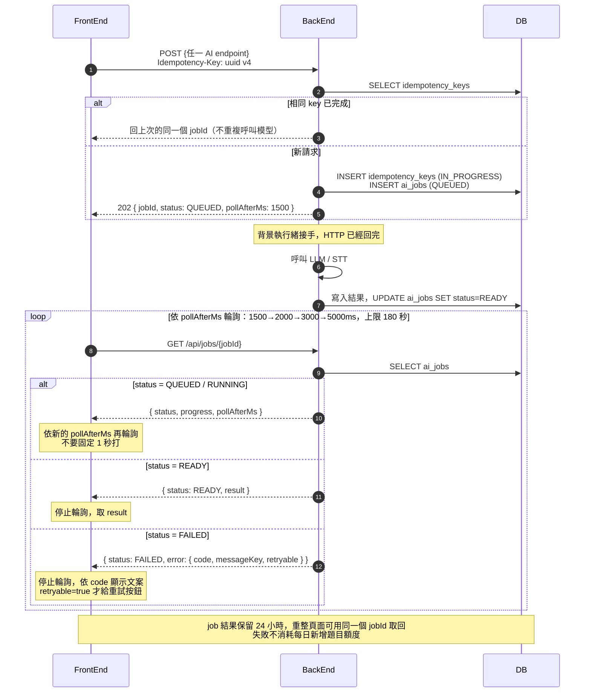
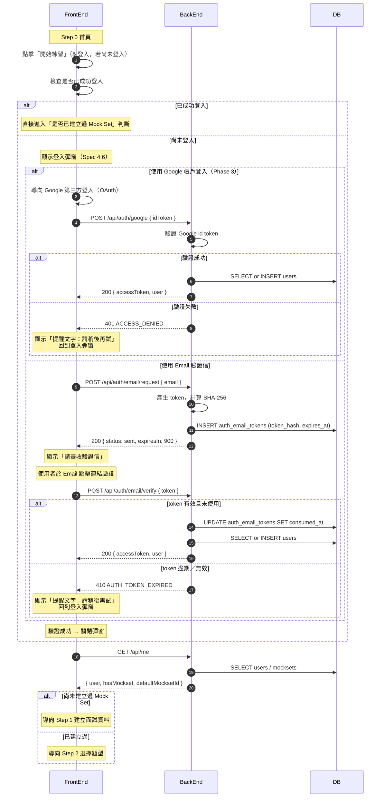
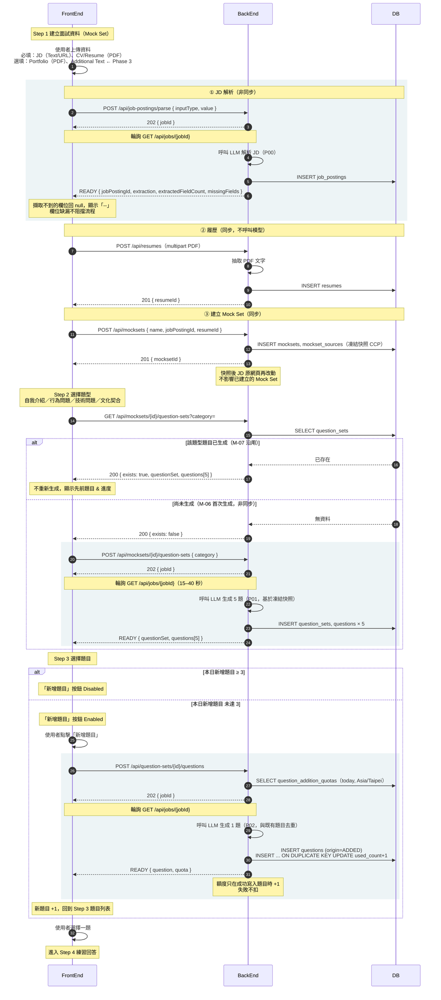
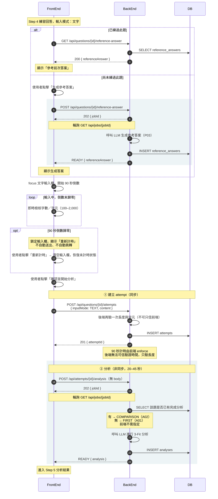
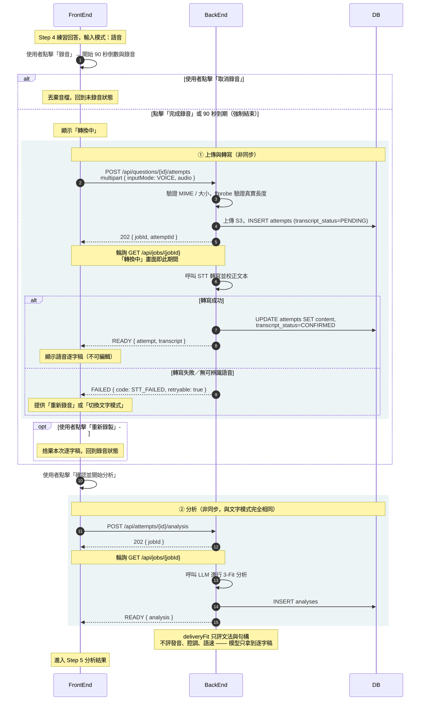
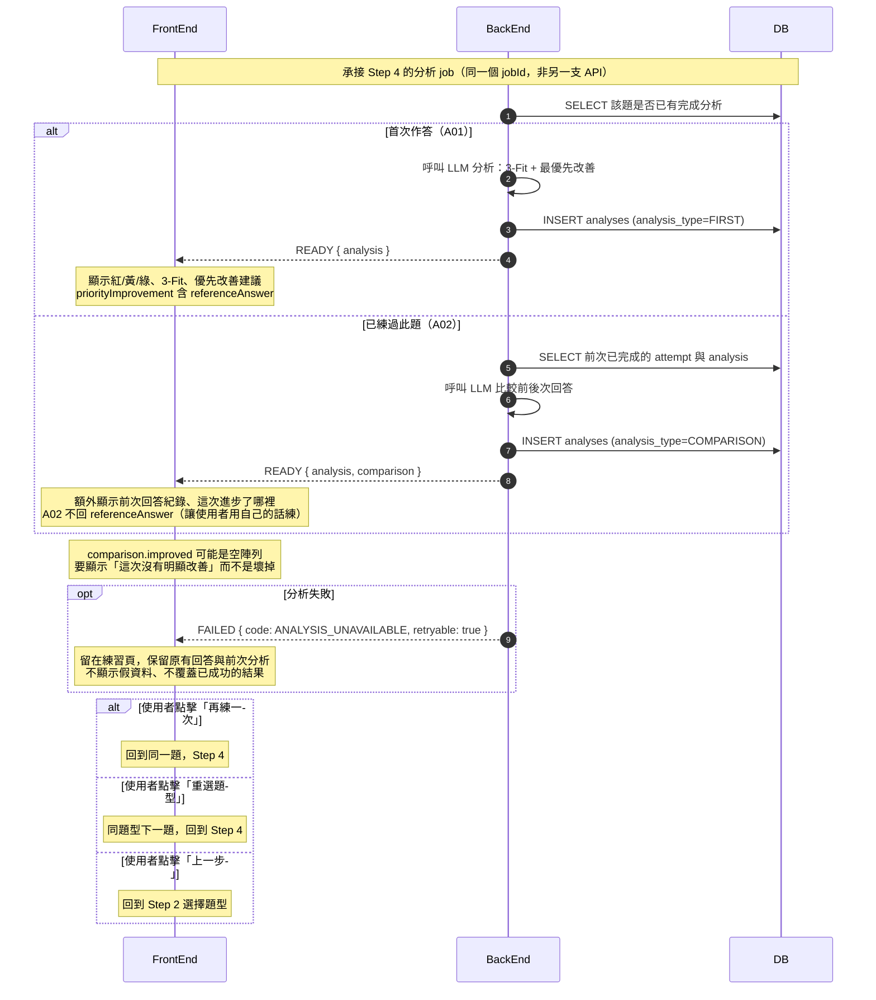

# reMockable User Story 時序圖（FE / BE / DB）

**狀態：DRAFT — 內部工作稿**

依 Figma user flow（`reMockable-userflow-20260901`）逐步驟改畫成時序圖， 固定只用 **FrontEnd / BackEnd / DB** 三條 lane。LLM、STT、S3、Email、Google 等外部服務 不另外拉 lane，收斂成 BackEnd 內部的自我呼叫與註記。

> **這份是內部工作稿。**給前端的正式交付是單一份 **《reMockable API 介面規格》**，這些流程圖已收錄在該文件第 3 章， 並與通用契約、27 支 endpoint 定義放在一起。本文件保留給 PM 與 tech lead 討論流程時使用，不單獨發給前端。

---

## 共用機制｜非同步 Job 通用機制（所有 AI 呼叫共用）

**只要那支 API 會呼叫模型，就是這個形狀。**前端只需要寫一次輪詢邏輯， 後面五張圖裡凡是標「非同步」的步驟都套用這裡，不再重複展開。 目前共 **6 支**：JD 解析、生成題目、新增題目、語音轉寫、參考答案、分析。

## Step 0｜首頁 → 登入彈窗（Email 驗證信 / Google SSO）

點擊「開始練習」若尚未登入，先跳登入彈窗（Spec 4.6）。Email 與 Google 兩條路徑最終都 匯到同一個「驗證成功」判斷；失敗會顯示提醒文字並回到登入彈窗重試。 這段全部是同步 API，不經過 job 機制。

## Step 1–3｜建立面試資料 → 選擇題型 → 選擇題目（含每日新增額度）

該題型題目已生成 → 不重新生成、沿用先前題目與進度；尚未生成 → 依 Step 1 的資料首次生成 5 題。新增題目按鈕是否 Enabled，取決於本日已新增次數是否超過 3 次。 **JD 解析、生成題目、新增題目三支都是非同步**，走上方共用機制。

## Step 4｜練習回答 — 文字輸入模式

90 秒倒數歸零不會自動送出——鎖定輸入欄、顯示「重新計時」。是否顯示「參考前次答案」 或「生成參考答案」，取決於這題是否已經練過（Step 5 判斷）。 **建立 attempt 是同步，參考答案與分析是非同步。**

## Step 4｜練習回答 — 語音輸入模式

錄音中可「取消」（丟棄音檔）；90 秒到期會強制結束並送出轉換，隱藏「重新錄製」。 逐字稿轉出後不可編輯，僅能「重新錄製」整段重來。 **上傳音檔後 STT 走非同步**，「轉換中」畫面就是輪詢期間。

## Step 5｜分析結果與後續動作

已練過的題目會多跑一次「前後次回答比較」，產出「這次進步了哪裡」。三個後續動作 （再練一次／重選題型／上一步）都回到練習迴圈，不是終點頁。 **比較不是另一支 API** —— 後端在同一個分析 job 內判斷，前端不需指定。

---

## 版本紀錄

| 編號 | 時間 | 人員 | 版號 | 說明 |
|---|---|---|---|---|
| — | — | Lyon | DRAFT | 尚未發布。內部審閱中，此階段的修改不列入版本紀錄。 |

> 本檔由 `scripts/gen_sequence_md.py` 從 `docs/user-story-sequence.html` 產生，請勿手改。
